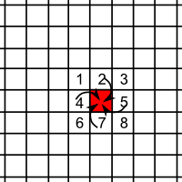
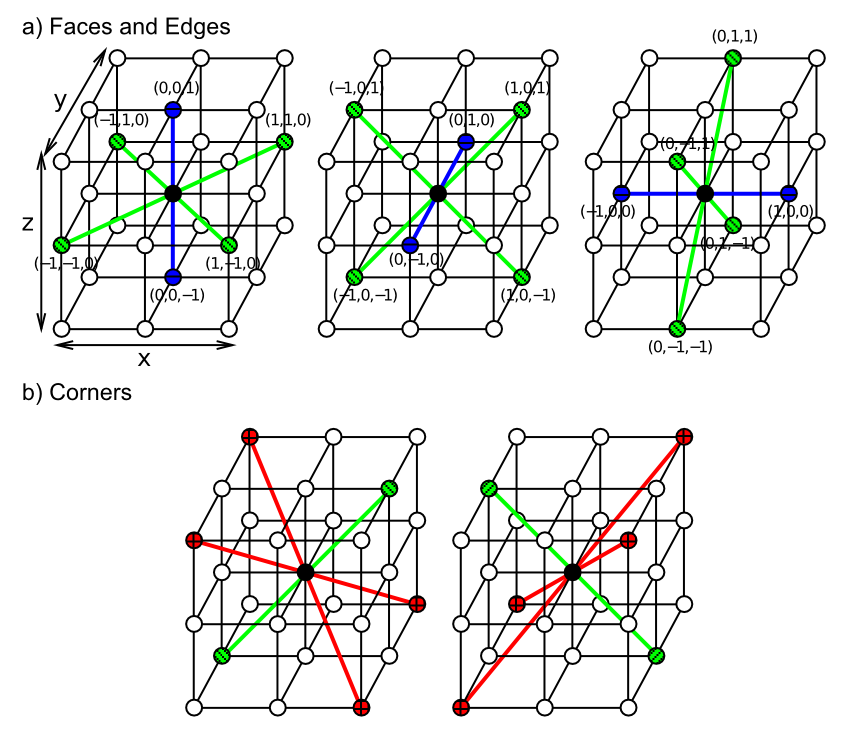

**IMPORTANT:** circa 2018 this exposition is now recognized as having important flaws, and nonlocality has now been established beyond reasonable doubt -- see [Phenomenology](Phenomenology "wikilink") for current draft ideas on new directions. This will presumably be rewritten if I get something working!

The quest to understand energy and matter at its most basic level has produced some of the greatest scientific advances of the past century, including unlocking the tremendous power locked up within the atom. Yet that quest has produced some of the most vexing puzzles known to science: elemental particles such as electrons sometimes behave like waves and sometimes like particles, and it appears that these particles can interact with each other in some ways over great distances, instantly: what Einstein termed "spooky action at a distance". Building upon these core mysteries, more recent theorizing has included serious discussion of curled-up, invisible dimensions beyond familiar 3D space, time travel, and other mind-boggling possibilities.

Perhaps there is an alternate explanation for the most basic workings of physics that results in a more mundane universe of just three dimensions, with strictly local physical interactions? Perhaps our own genius in compounding mathematical formulas to unlock the most basic secrets of energy and matter has created trapdoors through which our imaginations have fallen?

Throughout the history of science, fundamental advances have required fundamental new perspectives. What is proposed and demonstrated in this book is just that -- a new perspective based on the idea that everything, including seemingly hard little particles like electrons, is fundamentally a wave. This framework is called Wave Electrodynamics (WELD), which focuses on the interaction between the electromagnetic field as described by [Maxwell's equations](http://en.wikipedia.org/wiki/Maxwell's_equations#Units_and_summary_of_equations) and electrons as described by Dirac's wave equation for the electron -- the coupled [Maxwell-Dirac](Maxwell-Dirac "wikilink") system. Although this system has been explored by a number of people over the years, it is sufficiently mathematically complex that various approximations to the full system have been required to enable standard analysis techniques. In this book, we instead leverage the power of modern computers to numerically simulate the Maxwell-Dirac system in its full complexity, potentially overcoming the limitations of previous approaches, and attempting to eliminate the many problems that otherwise appear to render this fully wave-based approach implausible.

This book describes this framework and why it is arguably the simplest model of fundamental physics that can potentially account for all of the known phenomena. But if it really is simple, why isn't the WELD framework more widely known? Because there are several seemingly insurmountable problems with this framework, that prevent many physicists from even considering it. The objective of this evolving document is to steadily chip away at these problems, exploring different possible solutions through the power of explicit computational models (with great graphics!), and at the very least, learn a great deal about fundamental physics and the profound mysteries that still persist in our understanding of two of the most important elements of reality: "photons" and "electrons." Even though the quantum electrodynamics (QED) core of the standard model of physics [standard model](http://en.wikipedia.org/wiki/Standard_Model) (wikipedia link) is highly successful at computing the right answers, almost everyone finds it unsatisfying and puzzling, for a variety of reasons, and the WELD framework should provide an important new direction for more deeply understanding why and *how* QED actually works.

In this introduction, the central philosophical foundations of the approach are presented, which provide a general motivation for considering this approach, in the face of the many hurdles it must overcome. Ultimately, the value of the WELD approach must rest on its ability to make testable predictions for experimental outcomes that contrast with those of the standard model. But in advance of that, perhaps this introduction will encourage others to join the effort of developing this approach to the point where it can be properly evaluated.

An immediate advantage of the WELD approach in its current state of development is that it can serve as a useful introduction to many important concepts in physics, because the approach is so fundamentally simple. We develop very simple equations for wave dynamics, and use computer simulations to bring these waves to life using the [EmeWave](EmeWave "wikilink") simulator. By developing increasingly complex versions of these wave equations, we end up simulating all of electromagnetism and a large range of phenomena in electrodynamics, based on Dirac's wave equation for the electron. Along the way, you will learn all about [special relativity](http://en.wikipedia.org/wiki/Special_relativity) (wikipedia link), which emerges naturally out of wave dynamics. Thus, even if you are learning electrodynamics or quantum mechanics in a conventional course, this approach can provide a quick and relatively easy way to better understand the underlying phenomena, with a minimum of mathematics. Having this solid conceptual foundation can then make it much easier to understand all the standard quantum mechanical material.

# Overview

In the remainder of this chapter, we situate the WELD approach within the broader field, both from a conceptual and historical perspective, focusing on three key issues that shape the approach most strongly: a computational modeling approach, waves vs. particles as fundamental entities, and local vs. nonlocal interactions. Here, we introduce and summarize the WELD approach to these issues.

## The Computational Modeling Approach

The overarching goal is to simulate fundamental physics on a computer, in just the way that computer models are used in many other domains to understand how simpler mechanisms interacting over time and space can lead to more complex phenomena. This is perhaps most well known in the case of weather models, where basic physical mechanisms of heat, pressure, condensation, etc can be simulated to understand the complex phenomena that emerge. Although computer models have been used in theoretical physics, analytical mathematics remains the dominant methodology. One advantage of computer models is that they enable one to capture and understand complex **emergent phenomena** arising from nonlinear dynamics, that are difficult to handle with analytical approaches. The WELD models show that many fundamental paradoxes in the standard model can potentially be resolved through these emergent dynamics. Even the first step of thinking about how to implement a computer model raises a number of very important questions, which get at the heart of many fundamental problems in the standard model.

A number of researchers have argued that the most natural framework for computational modeling of physics is the **cellular automaton**, which forms the basis of the WELD model (Zuse, 1970; Fredkin & Toffoli, 1982; Fredkin, 1990). In a cellular automaton, space is divided into a uniform matrix of discrete cells, with state values in each cell that are updated in discrete time according to local neighborhood interactions. In its most general form, the cellular automaton approach is identical to the way that differential equations are solved on computers, using discrete grids and discrete time integration, which is the only way anyone has been able to actually implement the idealized continuous differential equations that appear everywhere in physics. Instead of viewing this as some kind of inconvenient artifact, we embrace this as a strong constraint on any concrete understanding of how nature actually operates at the most fundamental level: perhaps our inability to devise any truly continuous mechanism to implement differential equations is not just a limitation on our imagination, but instead represents a real constraint on nature as well. The essence of this constraint has to do with the difference between the set of integers vs. truly continuous real numbers -- real numbers require an infinity at each point in space in time, and are uncountable (see [Cardinality of the continuum](http://en.wikipedia.org/wiki/Cardinality_of_the_continuum) (wikipedia link). It is just not clear how any physical process could manage this kind of uncountable infinity at each point in space and time.

A defining feature of cellular automata, captured in the name, is that they are fully **autonomous** -- they just crank away iteratively and produce physical phenomena, without requiring any outside intervention, aside from establishing the initial state of the system. In contrast, analytic mathematics is all about figuring out special tricks to solve specific kinds of problems in the most efficient way possible, to arrive at a fixed answer to a specific question (e.g., what is the radius of an electron orbit in the ground state of a hydrogen atom?). This process obscures many of the issues that otherwise arise when trying to solve the general problem that works for all cases, autonomously, which is presumably what we imagine nature to actually be doing at every moment and every location in space. *Thus, we argue that attempting to develop a fully autonomous, fully general model of physics is the best way to truly understand how nature works.*

This distinction between fully general, **autonomous physical models** and analytical solution of specific problems using various **calculational tools** seems to be generally under-appreciated in the field, and there are many cases where calculational tools are mistakenly treated as physical models, leading to considerable confusion. We attempt to clarify this distinction with numerous examples, so that we can easily classify the various theoretical frameworks we encounter as either physical models or calculational tools, and thus have appropriate expectations about how they help us understand nature. Each has important and unique strengths and weaknesses, so we need both, even though our overall goal is to develop a physical model.

## Waves vs. Particles

One of the first decisions in implementing a computer model is how information will be represented, which then shapes everything else. In fundamental physics, there are two qualitatively different kinds of entities: **force fields** (e.g., the electromagnetic force) and **particles** (e.g., electrons). For classical electromagnetic fields, the most natural representation is a space-filling field model: you represent each point in space, with some number of state values at each point that are then updated according to interactions that propagate throughout the field. This is essentially the cellular automaton model. Particles are more difficult. In many ways the most natural particle representation is just a big list of particles, with each entry in the list containing the relevant state values (position, momentum, charge, etc). These state values are then updated as a result of interactions between the particles. It is also possible to represent discrete point-like particles in the field representation, by having state values that indicate the presence or absence of a particle at that particular location in space, along with perhaps other values needed to encode other properties of the particle (momentum, charge etc). But most of space is empty of particles, so the particle-list is generally more efficient.

The field representation is intuitively appealing because we already know that nature has just the right amount of 3D space to hold an all-pervasive physical field. In contrast, it is unclear how or where nature would store a list of particles, and how interactions between these particles would be mediated in any kind of general, autonomous manner. Is the list sorted by location? Does every particle interact with every other one on the list (which is exponentially expensive), or is there some kind of neighborhood localization? What happens when particles are created and destroyed, as happens all the time? What kind of fully general autonomous process can manage the insertion and deletion of particles on a list in just the right way at just the right time? These questions may sound like they are only considerations for the computer programmer. But the fundamental move here is to say: one way or another, nature faces the exact same challenges as a computer programmer. This *information processing* view of quantum physics is actually quite popular these days, and we take it to the extreme here, in really leveraging the core information processing implications of different representational schemes, to work back to how nature "represents" things like electrons.

There are several problems for the field representation of particles as well. The discretization of space and time makes it difficult to achieve smooth, isotropic (same in every direction) motion -- just like the diagonal lines on a computer monitor when you look up close, discretization causes "jaggies." Also, the issues of particle creation and destruction are potentially challenging here -- how can one convert energy in a field into creation of a particle at one point, and vice-versa for destruction? And how does one implement the interactions between forces and particles in a discrete system? Having spent a fair amount of time programming such models, they always ended up being very complex and "hacky" -- it just doesn't seem like nature could operate anything like this.

Given all these issues, quantum mechanics (QM) seems to provide a critical advance for our physical model: *particles can be represented as waves propagating in a field-like medium.* Each particle is associated with a coherent perturbation of this wave field that evolves deterministically over space and time. Thus, it would seem that we can get rid of all the complexities of discrete point particles, and instead retain a fully field-based representation of both forces and particles-as-waves. This simple, elegant solution to all of the above problems forms the conceptual core of the WELD approach. *Although this wave model may be generally appealing as an idea all by itself, the computational modeling perspective elevates it to an absolutely essential principle -- it solves too many problems in such an elegant way, without any viable alternatives in sight, to be tossed aside without anything less than the utmost effort to make it work.*

Unfortunately, it looks like it will indeed take a lot of effort to make this idea work. Although QM has a wave-based description of particles in the form of the **Schrödinger wave equation**, this wave description is vexingly co-dependent upon a complementary particle-based description, resulting in the paradoxical **wave-particle duality** that pervades the quantum realm. The uneasy co-existence of wave-like and particle-like behavior represents a central conundrum of QM. The standard interpretation of QM holds that the wave-like aspect of particles is entirely *non-physical* and instead merely represents the *probability* of finding a discrete particle in a given state in a measurement process, which is thought to engender a sudden collapse of the wave function down to the discrete outcome actually observed. The wave thus encodes our *knowledge* about the system -- it is a purely *epistemological* entity, enabling a quantum probability calculus that stands as one of the great *calculational tools* in physics -- it can be used to accurately calculate the results of many different kinds of experiments. Thus, despite the fact that all the mathematics of QM is based on wave mechanics, all the semantics and experimental data suggests that discrete particles are primary, and the wave is this strange non-physical halo that nobody quite knows how to think about. A quote from E. T. Jaynes is particularly apropos here:
  
"But our present QM formalism is not purely epistemological; it is a peculiar mixture describing in part realities of Nature, in part incomplete human information about Nature — all scrambled up by Heisenberg and Bohr into an omelette that nobody has seen how to unscramble. Yet we think that the unscrambling is a prerequisite for any further advance in basic physical theory. For, if we cannot separate the subjective and objective aspects of the formalism, we cannot know what we are talking about; it is just that simple." (Jaynes, 1990).

Thus, to make a physically real wave model work, we need to unscramble this omelette that nobody has yet been able to unscramble. Fortunately, Jaynes and several other pioneers did a lot of unscrambling, by establishing the **semiclassical** model of electrodynamics, which features a classical electromagnetic field evolving according to Maxwell's differential equations, interacting with an atomic system that has quantum mechanical properties. This contrasts with the standard QM model of electrodynamics (QED), which treats the electromagnetic field in terms of discrete **photon** particles, instead of the classical differential equations. Thus, by beating back one purported particle (the photon) and retaining the continuous electromagnetic field, we gain a toe-hold into the fully field-based wave model. The confusion surrounding the existence or non-existence of the photon is analogous to a common magic trick, where the magician draws attention to one obvious system (e.g., the rabbit that seems to disappear), when in fact there is a less obvious system that is actually responsible (e.g., an extra pocket in the magician's hat, that holds the rabbit hidden from view). In this case, the rabbit is the electromagnetic field and its purported particle-like properties, *which instead can be attributed entirely to the properties of the atomic system with which the EM field interacts* (the hidden pocket in the hat).

Devising a fully wave-based model of the electron is more difficult than vaporizing photons. Unlike photons, electrons have a lot of strong particle-like properties, such as an entirely consistent and conserved amount of electric charge, and the apparent propensity to remain localized over time, whereas wave equations invariably spread out and diffuse over time. A purely wave-based electron would seem to be too likely to splatter and leave drops of charge lying around all over the place. Here is where the potential power of computational simulations can be useful -- it may be that these problems have counter-intuitive solutions, through the emergent dynamics of the interacting wave equations. A previous iteration of the WELD philosophy held out the hope (which was also suggested by Jaynes and various other researchers) that the emergent dynamics of the electromagnetic field interacting with the electron wave field would produce an *emergent localization* of the electron -- it would magically remain only somewhat spread out over space. But simulations focused on this question strongly suggest that, despite various analytical results, this kind of emergent localization is *not* likely to hold. The wavy electron will just spread out over time, like any liquid left to its own devices. The wave equation is based on neighborhood interactions, and there just is no way to contain those interactions -- one neighbor is going to spread the word along to its neighbor, and so on, without any logical reason that it would ever exhibit a strong cutoff at some point.

But just like any liquid, the wavy electron can be contained by various other forces. First, the quark-based protons and neutrons in regular atoms experience the strong force, which has a property called *asymptotic freedom* -- the force gets exponentially stronger as the quarks get further apart, and thus it is essentially impossible to pull them apart. This means that the positively-charged heart of an atomic system will always be strongly localized, and given that it is attracting the negative charge of the electron, it is entirely plausible that the atomic system can contain, at least to some extent, a wavy electron blob. Second, in any real physical system, there is a great deal of action going on in the fields surrounding our wavy electron, and the constant interactions there can potentially result in a net localizing force. Indeed, we know that when you remove all these other forms of interactions, through extreme cooling in extreme vacuums, electrons and everything else tend to spread out and unify into a *Bose-Einstein Condensate* -- a weird form of quantum matter, that sounds an awful lot like a wave soup. Third, a cornerstone of QED is that the field is full of **virtual particles** that have been alternatively understood as the **zero point field** in other frameworks -- a base state of the field that contains a lot of energy -- this field may represent some kind of thermal equilibrium state of goopy waves of ancient "photons" and "electrons" etc that have been around since the big bang, and we definitely need to take the properties of this field into account in thinking about how electron waves propagate. Space is not empty according to *any* theory, and QED is exceptionally accurate, and virtual particles are a cornerstone of this framework, so we need to take this into account in one way or another. Fourth, electrons are subject to the weak force, which does have massive "force fields", and these might play some important and subtle role (which has yet to be included in the basic Maxwell-Dirac framework). Fifth, it is possible that the gravitational warping of space, though resulting in a very weak force over most scales, could possibly contribute something to the localization dynamic. Finally, we have to consider what if any role the newly-confirmed Higgs field mechanism might play in all this -- in its role of conferring mass, does it also perhaps drive an emergent localization dynamic? Thus, there is much to be investigated on this question.

Another key piece of the unscrambling puzzle comes from the **pilot wave** model of de Broglie (who initially proposed the wave-like property of massive particles like electrons), and Bohm. They were able to establish a fully consistent interpretation of QM where the wave serves to guide the trajectory of particles over time. For any given specific event, the particle has a specific trajectory through space, and the measurement process simply reveals the particle where it ends up, thus avoiding many of the mysteries and conceptual problems associated with the notion of wave function collapse in the standard QM model. This framework unscrambles two key contributions of the wave function: (a) the wave specifies the *initial uncertainty* in the location and momentum of the particles at the start of an experiment, and the way that this uncertainty inevitably compounds and thus spreads out over time; and (b) the *gradient* (local slope) of the wave nudges the particles as they move along their trajectory, producing the wave interference effects that are the unique signature of the wave-like nature of electrons and other particles. The first contribution is clearly purely epistemological -- it reflects our fundamental inability to know and control the states of tiny elemental particles. The second contribution is clearly physical -- it absolutely requires a physical wave propagating through space and influencing the particle trajectory. Thus, the pilot wave model unscrambles these physical and epistemological components of the overall Schrödinger wave function. However, the pilot wave model itself retains the notion of discrete particles, which cause further difficulties for this model, and we reject on principle in the WELD approach. Nevertheless, we can retain the conceptual unscrambling progress from the pilot wave model, while integrating the wave-packet model of particles.

In summary, the particle waves in WELD are *not* synonymous with the Schrödinger waves of standard QM, which are purely linear and, consistent with the standard theory, are best thought of as calculational tools for computing probabilities for experimental outcomes. Instead, the WELD physical model is based on nonlinear interactions between the electromagnetic field and the physical electron wave equation described by the Dirac wave function, plus all the other possible interactions mentioned above. One way to recover the full picture described by the standard Schrödinger waves would be for an emergently localized wave packet model of the electron to be combined with a healthy dose of purely epistemological uncertainty about initial conditions, which compounds over time. Overall, the resulting system would be similar in character to the de Broglie-Bohm pilot wave model, replacing discrete particles with localized wave packets. The oscillations of the Dirac waves could drive corresponding EM waves that produce the physical interference "nudges" that push the wave packets around. Again, there is much to be discovered here.

However, the one strong conclusion from the WELD framework is that it is highly likely that the current standard QM framework does not properly separate the epistemological and ontological components of the wave function, and almost all current work on QM theorizing seeks one extreme interpretation or the other: either the wave is fully epistemological or it is fully ontological. Instead, the pilot wave approach, and the WELD waves more generally, strongly suggest that there are separable epistemological and ontological components to the wave aspect of things, and our task is to continue the unscrambling process until we get this all sorted.

## Local vs. Nonlocal Interactions

One of the appealing features of the cellular automaton field model is that it can implement long-range physical interactions via strictly local interactions between adjacent cells in the matrix. The local nature of these interactions is important for the generality and autonomy of the physical model: the moment one starts to consider nonlocal interactions, questions arise as to how one part of space "knows" to interact with another distant region. The only fully general nonlocal interaction would be for every point in space to interact with every other point in space, which is such a fantastically intractable model that the mind reels to even contemplate it. Thus, another bedrock principle of the WELD approach, motivated from the goal of achieving a fully autonomous, fully general computational model of physics, is that nature supports strictly local interactions at the fundamental level.

However, again we face a strong challenge from the standard QM model, which is strongly nonlocal in a couple of ways. First, the process of wave function collapse must occur instantaneously across the entire spatial extent of the wave function, which can in principle encompass vast distances. This is an intrinsically nonlocal process, and most physicists believe that the nonlocality of wave function collapse has been definitively established experimentally, in a series of celebrated tests of **Bell's inequalities**, based on the initial framework of Einstein, Podolsky & Rosen (EPR) in 1935. However, these experiments have a set of fundamental flaws, that are begrudgingly acknowledged, but seemingly not fully appreciated by the broader field. Furthermore, the pilot wave model suggests that this collapse process is largely an artifact of epistemological uncertainty, and not an actual physical process -- the underlying particles are always definitely somewhere, and measurement simply lifts the veil of our ignorance.

The pilot wave model however contains the second form of nonlocality, where the wave function for multiple particles must be defined in a high-dimensional *configuration space*, which becomes exponentially large as the number of interacting particles increases (e.g., requiring $3^n$ values to represent the 3D positions of *n* interacting particles). This configuration space representation supports fully nonlocal interactions among particles, enabling the pilot wave model to account for the apparent nonlocality observed in the Bell's inequality experiments. One important reason that standard QM models, including the pilot wave model, require this configuration space representation is that they are based fundamentally on the linear Schrödinger wave equation -- linear equations are incapable of capturing particle interactions, because the waves simply superpose (additively combine) past each other, without impacting each other at all.

In contrast, the nonlinear interactions present in the WELD approach enable it to capture particle interactions in regular 3D space, potentially avoiding the need for the problematic configuration space representation.

Nonlocality is not just an aesthetic consideration -- nonlocal systems are fundamentally computationally intractable. Indeed, this is why the hot new field of quantum computing is generating so much excitement in the field: quantum physics appears to achieve something that standard computers fundamentally cannot do in an efficient way. This inefficiency is of the exponentially explosive sort, such that simulating quantum systems with more than a handful of particles requires more memory and time than there are atoms in the universe. This is the same kind of dynamic that leads to surprising facts, such as the extreme difficulty of folding paper more than 8 times, or the exponentially fast growth of populations.

It is not just that people are not sufficiently creative or current computers are too limited: there really is no way from a mechanistic, information processing perspective to understand how nature could pull off a fundamentally nonlocal computation. If we had rock-solid evidence that nature was indeed nonlocal in the way that standard quantum mechanics describes, then we would just have to accept this incredible state of affairs. But the evidence is anything but solid, despite the widely-held beliefs to the contrary of most in the physics community. As we discuss in detail later, there are a number of detailed physical models of the Bell's inequality experiments that produce the observed results, using purely local interactions (Marshall, Santos, & Selleri, 1983; Marshall & Santos, 1985; Thompson, 1996; Adenier & Khrennikov, 2003; Santos, 2005; Aschwanden et al., 2006; Adenier & Khrennikov, 2007).

## Opportunity, and Prospects for Success

The obvious question for any alternative to the standard model is, given that people have been wrestling with these problems for 100 years or so, why do you think *you* have any chance of solving problems that even a genius like Einstein couldn't solve? In other words, what basis is there for thinking that this approach will succeed where so many others have failed? Here are a number of relevant points:

- Most practicing physicists are no longer trying to solve these problems, and have fully accepted the basic framework of standard QM. In effect, most people are sufficiently indoctrinated into the current paradigm by the standard physics education, that they don't even consider alternative perspectives. So there aren't that many people actually working on these kinds of alternative solutions.
- Most of the methodology of standard physics depends on analysis of mathematical equations. In the case of the Maxwell-Dirac system, this is very difficult due to its nonlinearity. Thus, the use of numerical simulation methods, emphasized here, can potentially provide important new insights. It is only very recently that the computational power to simulate large three-dimensional systems of this sort has become available.
- The specific idea of resolving the wave-particle duality with the wave-packet model has been almost completely dismissed since the late 1920's, due to the spreading issue and other apparent problems. However, given that we know that the Schrödinger wave equation is incorrectly linear, and reflects a mix of multiple factors, it is entirely possible to solve this spreading problem. But this has not been deeply explored in the field.
- The broad acceptance of quantum nonlocality is another strong reason that most people completely ignore solutions of the form we're investigating.

Thus, it does not appear that anyone has previously investigated the specific set of ideas described here, and hopefully you'll be convinced from this chapter that there is sound reasoning and considerable promise behind the WELD approach, to continue reading.

In the remainder of this chapter, the points introduced above are explicated in greater detail, and put into historical perspective with the development of physical theories.

# The Computational Modeling Approach to Fundamental Physics

As we discussed in the overview above, the perspective of attempting to develop a computational model of any phenomenon raises a number of important questions that can otherwise be overlooked in purely verbal or even analytical mathematical theorizing. In many different fields, computational models serve to bridge between lower-level mechanisms and the often-complex behavior that emerges from the unfolding interactions taking place at this lower level. For example, computational models of neural networks in the brain can explain a wide range of complex cognitive phenomena in terms of a small set of basic underlying information-processing mechanisms supported by the biological properties of neurons and their synaptic interconnections. This corresponds to the classical *reductionistic* scientific theorizing -- reducing complexity at one level to greater simplicity at the level below it. In the standard hierarchy of science, we think of biology being reduced to chemistry, which in turn reduces to physics.

So what does physics reduce to? At some point, we have to posit a most fundamental, irreducible level, and expect that everything else can emerge therefrom. The critical advantage of computational models in this endeavor is that they enable the reverse of reductionism, which can be called **reconstructionism** -- actually reconstructing emergent complexity from simpler lower-level mechanisms. A computational model can bring complex phenomena to life, which can otherwise be very difficult to analyze mathematically, or reason about purely verbally, pictorially, or via other traditional means.

As we discussed above, the most natural, simplest fundamental, irreducible level of representation in a computational model of physics is a space-filling field, with local neighborhood interactions, which is essentially a cellular automaton. *If* a physically accurate model can be developed in the form of a cellular automaton, which captures all the known physical phenomena, then it would be difficult to conceive of a yet simpler model underlying that one. We describe the cellular automaton model in more detail next, followed by a discussion of the history of this form of field-based model.

## The Cellular Automaton Model of Space and Time, and Local Deterministic Interactions

**Figure 1:** Illustration of a simple 2-dimensional cellular automaton: space is divided into regular square cells (a uniform, regular tiling of space), and neighboring states interact by influencing the state update.  Time updates synchronously, setting the fastest rate of propagation as cell width / time update.

**Figure 2:** Neighborhood interactions in regular cubic tiling of space in three-dimensions -- these interactions are used to compute the wave equation locally.

A cellular automaton (CA) consists of a regular, uniform division of space into discrete *cells*, each of which has one or more *state* values, and each cell interacts only with its nearest neighbors (i.e., locally) to update its state value over time (Figure 1, 2).

Such a system was first described by Stanislaw Ulam in 1950, and has been popularized in its two-dimensional form in "the game of Life" by John Conway (described by Gardner, 1970). In this CA (widely available as a screensaver), there is a two-dimensional grid of square cells, with each cell having a single binary state value (0 = "dead" and 1 = "alive"). This state value updates in discrete, simultaneous steps as a function of the state values in the 8 neighbors of each cell. If the sum of the neighbors' states is \> 3 or \< 2, then the cell is dead (0) on the next time step (from "overcrowding" or "loneliness", respectively). Otherwise if it has exactly 3 live neighbors and is currently dead, then it is "born" and goes to 1, and if it was already "alive" then it remains so if it has 2-3 living neighbors. As anyone who has seen this system in operation knows, it is capable of producing remarkable complexity from such simple, local, deterministic rules.

The CA framework provides the simplest kinds of answers to fundamental questions about space, time, and the basic nature of physical laws (Zuse, 1970; Fredkin & Toffoli, 1982; Fredkin, 1990). Space is *real* and fundamental in the form of the underlying cells -- it isn't just an empty vacuum or a mathematical continuum. Instead, space is a discretized field. The discretization of space, as contrasted with a true continuum, can be motivated by the levels of infinities associated with the Cantor sets -- a discrete space corresponds to the lowest level of infinity associated with the integer number line, and thus represents the simplest way of representing space. One still has an infinity to deal with, and this is plenty mind-blowing all by itself -- space and time continuing infinitely in all directions, forever -- but at least the further difficulty of an infinity of space or time *within* any given segment can be avoided. And one can reasonably argue that the infinity of space and time is more plausible than the notion of an edge -- like the old flat Earth models and the end of the world, it is just an inconceivable notion to imagine such a junction between existence and nonexistence. We discuss these issues further in the [WELDBook/Cosmology](WELDBook/Cosmology "wikilink") chapter.

Time emerges naturally in its unique unidirectionality within the CA framework, simply as a discrete rate of change in the state values. And furthermore, the ratio of discrete spatial cell width to discrete rate of state update provides a natural upper limit to the rate at which anything can propagate within this system: i.e., the speed of light in a vacuum. Thus, this principal postulate of special relativity that light has a fixed upper speed limit emerges as a necessary consequence of more fundamental assumptions about the nature of space and time in the CA framework. Furthermore, as we will see in the subsequent chapters, the basic wave equation can be computed using a simple, intuitive, local neighborhood interaction among cells in a CA-like system, and Maxwell's equations for the electromagnetic field can be computed using primarily this basic wave equation. We discuss the more detailed features of special relativity in relationship to the CA framework next, after first introducing the relevant concepts, but the main conclusion is that this framework predicts all of the features of special relativity, from first principles based on the discretization of space and time, together with wave dynamics.

In summary, the CA framework is simple, elegant, and consistent with the most basic facts of physics. To reiterate, *if* one could develop a viable physical theory within the general confines of this framework, it would provide a preemptively simple and satisfying model of how nature works. It is hard to imagine how anyone could dispute the physical plausibility of such a model. Thus, no effort should be spared in attempting to develop such a physical model. The arguments against attempts to develop such a physical model should be treated with skepticism and subjected to extensive scrutiny. Alas, this appears to be a significantly minority view, not surprisingly so as we address the historical trajectory of quantum physics below.

## History of Field Models, the Aether, and Special Relativity

Theorizing in physics can be divided into two major epochs for our purposes -- the **classical** period which reached its zenith just prior to the development of quantum mechanics in the early 1900's, and the post-classical (and current) epoch of fully-developed quantum mechanics and the standard model, which started in the early 1930's. In between, there was an interesting period of transition -- the specific trajectory of theories and experiments in this transitional period served to frame the nature of the mature quantum mechanics that emerged. One can't help but wonder how differently things might have turned out if this trajectory had been different -- the influence of Albert Einstein was particularly complex, as we'll see. Overall, it seems that he may have done more than any other individual to prevent a WELD-like framework from emerging at that time, while at the same time, he was driven to develop a unified field theory that sounds just like what we want to accomplish with WELD, and he famously rejected the standard quantum mechanical theorizing.

In the classical worldview, people believed that electromagnetic (EM) radiation, described by Maxwell's equations (which represent one of the crowning achievements of the classical epoch), propagated throughout space via the **luminiferous aether** -- some kind of mysterious, all-pervasive substance that provided a *physical model* for the phenomena described by Maxwell's equations. The classical worldview was thus dominated by the intuitively satisfying notion that local, deterministic physical laws, operating autonomously through some kind of real physical medium, could produce the observed behavior of nature. This is essentially identical to the CA framework described above.

One harbinger of the end of the classical field model was the famous Michelson-Morley experiment of 1887, which is widely regarded as disproving the existence of the aether. This experiment used patterns of interference from light beams traveling in different directions to test for any differences in the speed of light as a function of the relative motion of the Earth to the aether. The idea was that if the aether is a fixed medium for light, the Earth must be moving in some direction relative to this fixed medium (as a result of its orbit around the Sun, and the Sun through the galaxy, etc), and this difference should thus be measurable in terms of the differential speed of light in different directions. The experiment revealed no such differences -- light always travels at the same speed in every direction $(c \approx 3.0x10^8)$, and by "us" sitting in a stopped train (on a siding presumably).

All the measurements in black are what we observe in this stopped reference frame, while those in red are what the speeding train guy observes. If we wait 100 nanoseconds (ns) ($1x10^{-7}$ seconds -- 100 times slower than the clock rate on a 1Ghz computer chip), then this light ray will have moved 30 meters. However, from our stopped perspective, the speeding train will be partially keeping up with the light ray, so that it will appear to have traveled only 4m relative to the moving train. Thus, in this stopped reference frame, where 100ns have passed for this light to appear to have traveled 4m, we might naively assume that someone on the speeding train would measure the speed of light as only $4x10^{7} m/s$ -- oops! But the Lorentz transformations of length and time exactly compensate. The length of the train in the direction of motion shrinks in half, so that people on the train measure the 4m in the stopped reference frame as 8m in the moving reference frame -- twice as long. Furthermore, time moves more slowly for the speeding train, such that the 100ns in our reference frame is measured as only 50ns in the speeding train reference frame (at a static reference point in the speeding train, which is the very back of the coal tender in this example). The measurement of time is very strange in special relativity, because what is observed as occurring at the same time (simultaneity) across different reference frames depends on both time *and location*. Thus, when the light ray is measured at 8m ahead of the back of the coal tender, this registers as only 26.8ns of elapsed time! If you divide this 8m by that amount of time, it comes out to exactly the same speed of light as in the stopped frame. The time transformation equation is: $t' = \gamma (t-vx/c^2)$ and the position transformation is: $x' = \gamma (x-vt)$, where t' and x' are as measured on the speeding train and t, x are on the stopped one, and $\gamma = 1/\sqrt{1-v^2/c^2}$.}}

Then, in 1905, Einstein published his famous paper on special relativity, which elevated the constant speed of light to the status of a fundamental principle, along with the **principle of relativity**: that physics should appear the same in any given (inertial) reference frame. This was philosophically the opposite of the discredited classical notion of a fixed aether medium, which constitutes a privileged reference frame where the aether itself is standing still. This new principle seemed much more appealing than believing in an invisible aether that coincidentally seems to be unmeasurable. Hence, relativity soon became a bedrock of thinking in physics.

61802:{{fig3|1|fig_lorentz_xform.png|600px|right|The Lorentz Transformation, a central property of special relativity, which causes length in the direction of motion to shrink and time to expand (dilate) as a function of relative speed, in just such a way as to preserve the observed speed of light regardless of how fast one is going.  The matter wave equation exhibits exactly this behavior, which completely masks any fixed matrix in which such waves might be implemented.  In this example, a speeding light ray is observed at a given time t by an observer in a train speeding along at 86.6% of the speed of light {{&lt; math &gt;}}(c \approx 3.0x10^8){{&lt; /math &gt;}}, and by &quot;us&quot; sitting in a stopped train (on a siding presumably).  All the measurements in black are what we observe in this stopped reference frame, while those in red are what the speeding train guy observes.  If we wait 100 nanoseconds (ns) ({{&lt; math &gt;}}1x10^{-7}{{&lt; /math &gt;}} seconds -- 100 times slower than the clock rate on a 1Ghz computer chip), then this light ray will have moved 30 meters.  However, from our stopped perspective, the speeding train will be partially keeping up with the light ray, so that it will appear to have traveled only 4m relative to the moving train.  Thus, in this stopped reference frame, where 100ns have passed for this light to appear to have traveled 4m, we might naively assume that someone on the speeding train would measure the speed of light as only {{&lt; math &gt;}}4x10^{7} m/s{{&lt; /math &gt;}} -- oops!  But the Lorentz transformations of length and time exactly compensate.  The length of the train in the direction of motion shrinks in half, so that people on the train measure the 4m in the stopped reference frame as 8m in the moving reference frame -- twice as long.  Furthermore, time moves more slowly for the speeding train, such that the 100ns in our reference frame is measured as only 50ns in the speeding train reference frame (at a static reference point in the speeding train, which is the very back of the coal tender in this example).  The measurement of time is very strange in special relativity, because what is observed as occurring at the same time (simultaneity) across different reference frames depends on both time ''and location''.  Thus, when the light ray is measured at 8m ahead of the back of the coal tender, this registers as only 26.8ns of elapsed time!  If you divide this 8m by that amount of time, it comes out to exactly the same speed of light as in the stopped frame.  The time transformation equation is: {{&lt; math &gt;}}t' = \gamma (t-vx/c^2){{&lt; /math &gt;}} and the position transformation is: {{&lt; math &gt;}}x' = \gamma (x-vt){{&lt; /math &gt;}}, where t' and x' are as measured on the speeding train and t, x are on the stopped one, and {{&lt; math &gt;}}\gamma = 1/\sqrt{1-v^2/c^2}{{&lt; /math &gt;}}.}}

However, it remains remarkably under-appreciated to this day that special relativity is *entirely compatible* with the notion of a luminiferous aether, and indeed provides exactly the right explanation for why the Michelson-Morley experiment failed to detect it: because the speed of light is a constant, the lengths of objects must actually contract in their direction of relative motion, and time dilates, so that even if you are racing very close to the speed of light, almost keeping up with a speeding light ray, you measure the speed of this light to be the same as someone standing still . Specifically, because your measuring devices (rulers) have all shrunk in the direction of motion, distances appear longer, and time dilation causes measured time intervals to appear shorter, with the net result that a moving observer obtains the same measured distance per unit time (i.e., speed) that someone standing still would measure. This **Lorentz transformation** was already well established prior to Einstein's 1905 paper, based on measurements of electromagnetic phenomena.

Thus, we only need to modify our understanding of the properties of the aether, in accordance with the Lorentz transformation, to reconcile the appealing classical world view with the observed facts. But there are two obvious problems with such an approach. First, the aether becomes essentially unmeasurable, and thus a belief in its existence would seem to be outside the scope of objective science. Second, the framework of special relativity has no need for such a thing, and relativity provides such a nice compelling and self-contained world view, that there is no motivation to retain this clunky, outdated notion of the aether. And thus, the notion of the aether drifted away like, well, so much aether.

It turns out that the CA framework with waves that represent massive particles naturally produces the Lorentz transformation, and thus specifically predicts all of special relativity. As we will see in the next chapter, the simplest form of wave equation always propagates at a fixed speed (like light), but there is a very straightforward extension of that equation, involving the introduction of a *mass* term, that results in waves that can travel at any velocity below the speed of light, in proportion to the wavelength of the wave. This relationship between wavelength and speed is *exactly* as required by the Lorentz contraction, and thus we see fundamentally why the aether is invisible to us -- it emerges directly from the nature of wave dynamics. Therefore, instead of thinking of the Lorentz transformation as an *ad-hoc* way of reconciling the notion of an aether with the null results of the Michelson-Morley experiment, we can see that it is a necessary consequence of wave-based physics. Historically, unfortunately, the matter wave equations were not developed until the 1920's, long after the aether had been relegated to a historical artifact, so this point was likely not very salient at that time. The historical trajectory of science does seem to be important.

Although the elastic nature of space and time described by special relativity are taken for granted in modern physics, it is important to appreciate how fundamentally strange this is, if you think of matter consisting of hard little particles. In contrast, the wave-based model of matter produces this elasticity very naturally and automatically -- matter is literally fluid and flexible. We will encounter this contrast again several times, for example in the context of particles being created out of raw energy, and destroyed back into a burst of energy -- this kind of fluidity is entirely compatible with waves, and seems hard to reconcile with the notion of hard little particles.

In summary, the CA framework provides a very different perspective on special relativity, showing how its essential features emerge from mechanistic considerations of how to most fundamentally perform physical interactions in space and time. Although the mathematical results are entirely equivalent, the appealing mechanistic physical model provided by the CA framework makes it arguably more fundamental than the abstract principle of relativity.

Indeed, relativity affords almost no guidance for thinking about how nature could operate autonomously at a mechanistic level. The primary mathematical constructs in relativity involve converting values between different reference frames using the Lorentz transformation equations, as in . Without any primary, privileged reference frame, the best you can do is take any two and convert between them. But what good is this as a physical, mechanistic model of nature? Do we imagine that nature is constantly converting between reference frames all the time? Why would any given reference frame be chosen over another, and what would trigger a conversion, and what would be the point of doing any of this in the first place? In short, because the physics is the same in any reference frame, there is nothing to constrain the choice of any given one, and thus there is a fundamental indeterminism as a physical model if all you have is the bare principle of relativity itself. *Relativity is just a self-contained, internally consistent description of itself.*

The fact that the far stronger commitments to mechanism made by the CA framework align so well with what we know about space and time, and naturally yield the postulates of special relativity as a consequence thereof, seems like a much more striking coincidence. Therefore, we conclude that even though the mathematics are identical, and thus no experiment can distinguish between them (at the level of special relativity), CA wave dynamics (i.e., WELD) is a more useful theoretical framework for understanding how nature actually functions. To further elaborate this distinction, we next consider more generally the distinction between autonomous physical models (exemplified by WELD) and calculational tools (exemplified by special relativity).

## Calculational Tools vs. Autonomous Physical Models

We define an **autonomous physical model** as a theoretical and mathematical framework for representing physical processes that can iteratively produce observed physical phenomena in a very general way, without requiring special configuration or tuning for particular types of problems that need to be solved. In contrast, a **calculational tool** is a theoretical and mathematical framework that enables specific results to be calculated, often in one analytical step, typically requiring careful configuration of the equations tailored to the specific case in question. Each of these two different kinds of theoretical frameworks in physics has different advantages and disadvantages for different applications, and a failure to distinguish between them can lead to myriad confusions, while keeping these categories in mind clarifies many issues. Special relativity is an example of a calculational tool -- it is a systematic set of equations that enable one to calculate the results of experiments. This tool requires a person to configure and use it properly -- it does not just crank away autonomously in the way that we imagine nature operating independent of our own descriptions of it. In contrast, the cellular automaton is a paradigmatic example of a physical model -- it provides a way of understanding how nature might actually operate, independently and autonomously cranking out the phenomena we observe.

The notion of autonomy provides a critical distinction between the two kinds of frameworks: whereas calculational tools typically require lots of expert knowledge of how to represent a given physical situation, a physical model can just iteratively crank away without any expert intervention, and accurately reproduce the known physics. Calculational tools can typically produce results in one step, whereas physical models require integration over many steps, because they accurately reflect an underlying iterative physical process, and are thus typically more difficult to analyze mathematically.

To make these ideas concrete we consider a few examples:

Newton's theory of gravitation (still widely used in practice) is a calculational tool that enables gravitational effects to be computed in terms of the respective masses ($m_1$, $m_2$) and distance *r* between the centers of mass of two bodies:

$$
 F = G \frac{m_1 m_2}{r^2}
$$

But this is not a physical model that could function autonomously, because the math requires one to somehow know the physical distances between relevant objects (and their respective masses), and not only is this a nonlocal computation, there are a potentially infinite number of other bodies that need to be taken into account. Because of the well-known **n-body problem** with this kind of equation, one must carefully choose which entities to include in the calculation, depending on the exact nature of the problem being solved. By contrast, one would expect that a general, autonomous physical model would compute gravitation directly from the collective effects of each individual atom within all the different celestial bodies in the universe, at which point the Newtonian computation is completely unworkable and absurd.

Einstein's *general* theory of relativity, on the other hand, shows how entirely local, speed-of-light propagation of spacetime curvature, operating according to uniform functions at each location in space and time, can convey gravitational forces without any of the problems associated with the Newtonian calculational tool. It is a true autonomous physical model of the best kind: the mathematical constructs map directly onto physical processes that are entirely plausible and compelling for what nature can be autonomously doing to produce the phenomenon of gravitation.

Coulomb's law for the strength of the electric field as a function of distances between charged particles is very similar to Newton's gravitational formula, and similarly represents a useful calculational tool, but is not a good model of how physics actually operates, for all of the same reasons. Similarly, the Coulomb gauge formulation of Maxwell's equations implies immediate action at a distance for the electrical potential, which is clearly incompatible with special relativity. It turns out that some nonlocalities in this framework actually cause the observed EM fields to still propagate at the speed of light, but one can still get into trouble using this gauge incorrectly (Brill & Goodman, 1967; Jackson, 2002; Onoochin, 2002).

In contrast, Maxwell's equations in the Lorenz gauge provide a very appealing physical model of electromagnetism (EM), involving simple local wave propagation dynamics operating on the four-vector potential (we'll describe later exactly what this math means -- for the time being, just appreciate how incredibly simple this equation appears, and also appreciate that it describes a completely local interaction):

$$
\partial_\mu \partial^\mu A^\mu = k_\mu J^\mu
$$

In this physical model, EM waves naturally propagate at the speed of light, everything is automatically consistent with the constraints of special relativity, and it is again easy to imagine how autonomous physics can happen like this.

Nevertheless, the reason that people still use Newton's gravitational equation instead of Einstein's equations, and prefer the Coulomb gauge over the Lorenz gauge, is that these frameworks are vastly simpler for calculating the kinds of experimental results people actually need in practical applications. Thus, it should be clear that both calculational tools and physical models play essential and complementary roles in the field, and should in no way be construed as mutually exclusive (even though people inevitably do). Even though physical models are often not convenient frameworks for calculation, they play a crucial role in grounding and constraining physical intuition, which should then inform the application of calculational tools. In particular, calculational tools often contain shortcuts and simplifications relative to the underlying physical model, and one can obtain nonsensical results if these are not appreciated (e.g., accidental violations of speed-of-light propagation in the Coulomb representation).

Finally, it is remarkable that in so many instances, there are essentially equivalent complementary descriptions of the same phenomena: a calculational tool and an autonomous physical model. We will see that the standard model, and standard quantum mechanics more generally, has all the hallmarks of a calculational tool. And no corresponding autonomous physical model has yet been described. This is the missing piece that the WELD framework is intended to provide.

## The Importance of Locality for Autonomous Physical Models

There is a clear pattern in the examples of autonomous physical models, as contrasted with calculational tools. *All* of the autonomous physical models leverage *local* propagation of signals according to simple laws, whereas all of the calculational tools employ nonlocal equations. This is directly tied to their fundamental tradeoffs -- the calculational tools need nonlocality to enable single-step calculations, whereas the physical models use local dynamics to enable iterative, autonomous calculations to work in the general case. It is difficult to imagine how an autonomous model could be nonlocal -- unless every entity interacts with every other one (complete nonlocality, which is computationally intractable), then it seems that there must be some kind of decision made to determine which nonlocal interactions should take place in a given situation. How can this decision be made in a completely autonomous manner? These problems with nonlocality will recur as we continue to examine more physical domains, and seems like a sufficiently general problem that it strongly motivates skepticism of nonlocal frameworks. We can provisionally state that any nonlocal model must be a calculational tool, and there should be a corresponding physical model that leverages local iterative computations to produce the same overall results. Again, WELD is intended to be this local physical model.

# Waves vs. Particles

Having established some conceptual foundations of the WELD framework with respect to space, time and the nature of physical mechanisms, we now turn to the issues associated with a purely wave-based model of physics, with no trace of hard little particles. It is remarkable how little attention has been devoted to such a purely wave-based model, and it seems that we can attribute at least some of this to psychological issues. People can't help but project the features of our daily experience onto our conceptions of how physics should work. This is generally referred to as *anthropocentrism*, and it is constantly creeping into physical theory. For example, we live in a world composed of seemingly solid "matter" that moves through a transparent gas (air). This underlies the ubiquitous model of solid little particles of matter that somehow float through an empty vacuum of space. We'll see as we progress that this particle-based worldview creates innumerable problems and contradictions, and yet it seems difficult for people to consider the obvious alternative: a pure wave ontology. Certainly there are some apparent problems with the waves-only view, but none of them rise to the level of deep paradoxes and divergent mathematics that accompany the particle-based approach.

We start by dealing with the conceptual difficulties that were introduced by Einstein by proposing the *photon* particle, which has an uncomfortable co-existence with the purely field-based model of electromagnetism provided by Maxwell's equations. This juxtaposition of particle and wave models for the same thing paved the way for a more pervasive wave-particle duality in the subsequent development of quantum mechanics. Again, we see the difficulties that Einstein seems to have created for a purely wave-based model. And unnecessarily so, it seems, as we find that the photon model can be dispensed with, by recognizing that it is just a misplaced accounting of quantized atomic properties -- one can account for all the relevant phenomena using the classical EM field, interacting with a quantized atomic system (i.e., the **semiclassical** model of electrodynamics; Jaynes & Cummings, 1963; Jaynes, 1973; Mandel, 1976; Grandy, 1991; Marshall & Santos, 1997; Gerry & Knight, 2005).

Next, we see if the same disappearing act can be performed for the hard particle aspect of the electron -- this turns out to be considerably more difficult, in part because almost nobody has seriously tackled this idea before. Nevertheless, none of the various challenges appear to be insurmountable, and we can at least sketch the outlines of purely wave-based model. This process also illuminates many of the features of the standard quantum mechanics framework that unambiguously qualify it as a calculational tool, not an autonomous physical model.

## The WELD Model of Electromagnetism and the Photon Magic Trick

We begin by returning to the year of 1905, and another of Einstein's triumvirate of revolutionary papers from that year, that put another major nail in the coffin of the classical worldview. This paper provided a simple and compelling model of the photoelectric effect, and introduced the notion of a particle-like doppelgänger of the electromagnetic field, which we now call the *photon* (this term was not introduced until the 1920's). The central puzzle of the photoelectric effect is that only the frequency, not the amplitude, of light determines whether it will excite an electron in an atom. You can shine a very bright light on an atom, but if the frequency of that light is below the critical value for that atom, then the electrons will remain in their ground state.

Einstein's model borrowed some key ideas from Planck's 1901 paper on blackbody radiation, which introduced Planck's constant *h*, and arguably represents the very first paper on quantum mechanics. In this paper, Planck was able to accurately characterize the spectrum of thermal black-body radiation in terms of quantized oscillators whose energy was proportional to their frequency, but he made no particular commitment to the physical nature of these discrete oscillators, and regarded them initially as merely mathematical contrivances. Einstein in turn postulated discrete particle-like entities that carry energy in proportion to their frequency $\nu$ times Planck's constant:

$$
E = h \nu
$$

This accounts in principle for the photoelectric effect, because there is no longer any intensity in the energy equation -- only frequency. An intense beam just has more instances of these discrete photons, but if none of them individually have sufficient energy to excite the atom, then the number of them doesn't matter. There is an assumption that only one photon can interact with an electron at a time, so energy from multiple photons cannot contribute additively.

This is the first instance of the paradoxical *wave-particle duality* that lies at the heart of quantum physics. This photon particle model has no clear relationship to the classical EM field described by Maxwell's equations, and this juxtaposition of two radically different descriptions of the same thing has left people in a quandary ever since. As with special relativity and Michelson-Morley, things might have been different if extant classical principles had not been so quickly rejected in favor of the beguilingly simple photon model. Like special relativity, this quantum photon model is a calculational tool that does a great job of providing a simple description of the phenomena in question, and is extremely handy for calculating the results of experiments, but it really obscures the underlying mechanisms at work.

In particular, *the photon model ascribes properties to EM radiation that are actually properties of the atomic system.* If one instead recognizes that the atomic system, not the EM radiation itself, can have this discrete frequency-based behavior in its interaction with the continuous, classical EM field, then the quandaries and paradoxes start to disappear. As noted earlier, the situation is analogous to a common magic trick, where the magician draws attention to one obvious system (e.g., the rabbit that seems to disappear), when in fact there is a less obvious system that is actually responsible (e.g., an extra pocket in the magician's hat, that holds the rabbit hidden from view). As we elaborate below, this sleight-of-hand that Einstein pulled out of his hat just over a hundred years ago snowballed into the full strangeness of the standard theory of quantum mechanics.

61874:{{fig4|1|fig_tacoma_narrows_bridge.png|400px|right|Widely-cited dramatic example of resonance: the wild oscillations and subsequent collapse of the Tacoma Narrows Bridge, due to wind driving the bridge to flutter at a resonant frequency, creating an increasingly strong oscillation that drove it to collapse.  Resonant dynamics can explain the dependence of the photoelectric effect on the frequency of the EM waves.}}

In contrast to the photon model, the *semiclassical* explanation of the photoelectric effect is based on a purely classical (Maxwell's equations) model of the EM field, which interacts with a quantized atomic system to produce the observed frequency dependence on absorption (Jaynes & Cummings, 1963; Jaynes, 1973; Mandel, 1976; Grandy, 1991; Marshall & Santos, 1997; Gerry & Knight, 2005). The basic intuition behind these semiclassical models is that electrons are locked into bound states in the atomic system, and a minimum resonant frequency is required to wedge them out of these states () -- any wave that is below this minimum frequency just doesn't resonate properly with the electron, and it just passes right through. These bound electrons have discrete, quantized energy levels because they obey wave equations, and essentially these waves must vibrate like drums or guitar strings, with an integral number of wavelengths fitting within the overall space available in an atom.

By now, this standing wave model of atomic electrons is very well established, and is clearly responsible for the quantized overall behavior of atoms. The frequency dependence and quantized nature of the atomic system would hold if it interacted with *anything* -- it would be impossible for the EM field to behave other than in this discretized manner in its interactions with atoms. Thus, the notion of attributing the discreteness to this novel "photon" particle would seem to be quite an extra ("quantum" if you will ;) leap. However, Einstein's photon model of 1905 predated any understanding of the wave nature of electrons in atomic systems by roughly 20 years -- just another example of how the trajectory unfolded in an unfortunate way.

Another clue that there is something fundamentally misplaced in the photon model is the presence of planck's constant *h* -- we will see that this constant arises directly from adding mass to the wave equations, where the waves travel at speeds less than the speed of light (i.e., the Klein-Gordon and Dirac equations). Because light (electromagnetic radiation) has no mass, there is no reason for there to be such a constant associated with it, and the classical EM equations have no place for this constant. On this basis alone, it seems clear that the photon energy is based on the atomic sources and sinks of EM waves, not the EM field itself. But again, this association of *h* with matter waves came later -- in 1905, it was just this mysterious brand-new constant that seemed to be solving mysteries right and left.

Although the photoelectric effect has a fairly compelling semiclassical explanation, there are other phenomena that are harder to explain within this framework. For example, it is possible to have a system that emits a single "photon" of EM energy at a time, and this photon can then be detected later. Advocates of the photon model argue that it is only detected in one specific location, which seems like evidence for a localized little particle, and not a more broadly distributed wave. However, we must appreciate that the source of the EM field with sufficient energy to excite an atom is typically the spontaneous emission of photons from other atomic systems. This means that these photons were "created" by a kind of mirror image of the very same discrete process involved in detecting the photons -- this should impart a temporal, spatial, and energy-level discreteness to the EM radiation in the first place. It is essentially impossible to record the specific profile of these EM waves, but in some cases it is likely that they have a spatiotemporal concentration that is in effect somewhat particle-like (we'll discuss this more below in terms of a wave packet).

However, as light travels over longer distances, any such spatial concentration will spread out, as we'll see in the [Waves Chapter](ch02_waves.md). For example, any "photons" from a distant star will be completely spread out over space. This is an inevitable fact of wave propagation, which is otherwise essential for understanding many other aspects of light (diffraction, etc). Thus, there are definitely cases where light is detected, and the EM waves are very certainly not spatially localized. This is only a puzzle if one insists on the principle that the interaction between the atomic system and EM waves is strictly restricted to operate on single photons. If instead one considers that amplitude might actually still matter (in addition to frequency and resonance), and that the reason we can see distant starlight is because it is extremely bright at the source, so that in effect the waves are strong enough to survive the long journey with sufficient amplitude to excite the relevant detectors, then there is no real puzzle here. It is difficult to experimentally test these predictions, because they only hold for very dim single-photon sources, and there are significant constraints on the ability to efficiently detect such photons, which we discuss below in the context of experimental tests of nonlocality. In any case, the exact nature of how the EM field carries energy and interacts with atomic systems via emission and absorption remains somewhat mysterious, and developing a clear physical model of this process is a major goal of the WELD approach.

At the present time, it seems that the strongest defense of the photon model comes from statistical properties of photon emission (e.g., anticorrelations; Grainger et al., 1986; and antibunching; Hong et al., 1987). Semiclassical accounts of these phenomena have been provided, by leveraging an additional stochastic process associated with the hypothesized zero point field (Marshall & Santos, 1988, 1997), but this work has failed to overturn the status quo belief in photons, perhaps in part because of various important outstanding issues associated with this zero point field construct. We discuss these issues in greater detail later in the book.

Overall, this semiclassical physical model requires much more complex calculations and conceptual frameworks than the simple ideas and math associated with the photon model. This should be familiar, in terms of the dichotomy between calculational tools (the photon model), and physical models (the semiclassical model). Thus, we fully agree that the photon model is useful as a calculational tool, while stressing that it should not be taken as a physical model: there really is no reason to believe that such a thing as a photon actually exists in nature. In the next section, we find that the notion of a photon in the standard model (i.e., quantum electrodynamics or QED) developed from the simple discrete particle envisioned by Einstein (and probably by most of you), into quite a different thing entirely, which is in many ways the exact opposite.

### The QED Photon: An Infinite, Positionless Wave

61892:{{fig5|1|fig_fourier_transform.png|300px|right|The Fourier transform, which is the basis of the photon model in QED.  A fourier transform converts a function from normal physical space into an orthogonal basis space of sine waves parameterized according to their amplitude, phase and frequency.  No position parameter is retained in Fourier space -- the sine waves are infinite in extent.  The QED model of the photon is, incredibly, one of these Fourier sine waves, similarly infinite in extent, without any physical localization.}}

In QED, the photon is represented in Fourier space, as an integer mode of the field -- i.e., one Fourier component, with a specific frequency and phase (). Taken literally, this means that the photon is distributed across the entire universe, because a Fourier component is not localized in space. Fourier space is based on an orthogonal basis compared to the normal space-time basis, and the very idea that a physical entity could be described in terms of this mathematical abstraction seems frankly absurd as a physical model. It captures *nothing* like a localized particle that one might have otherwise imagined from Einstein's photon model. Nevertheless, it clearly works fantastically well as a calculational tool, producing the most accurate predictions of any physical theory. It seems obvious, but widely unacknowledged in the field, and certainly in the popular press, that this means that all the math just happens to work out a lot better in Fourier space. This kind of thing is done all the time in many areas of science, but nowhere else do you find people thinking that this means that the physical world is actually like Fourier space.

The mathematical connection between QED and Einstein's photon model is that a given Fourier mode has a single, uniform frequency, so it is easy to associate each mode with a specific energy according to the $E = h \nu$ equation. Furthermore, Fourier space enables a convenient way of mathematically managing the creation and annihilation of photons. And this framework enables QED to capture the **self field** or **radiation reaction** of the EM field produced by the electron, acting back onto the very same electron, which transforms otherwise linear equations into nonlinear ones, which are much more difficult to manage mathematically. It was apparently not possible to capture this self field dynamic in the conventional QM framework prior to QED, and there is every indication that a great deal of the celebrated accuracy of QED is due to its ability to handle this challenge. And it wasn't easy -- the many deep mathematical complexities associated with the renormalization and perturbation framework in QED reflect the mathematical challenges associated with capturing this dynamic correctly. It is an amazing testament to the perseverance and creativity of the many scientists who helped to develop QED that they were able to work through all these difficulties.

We will show in this book how this self field can be captured in numerical simulations, which are essentially numerically simulating a cellular automaton-like version of the [Maxwell-Dirac](Maxwell-Dirac "wikilink") system, without any real difficulty or complexity whatsoever. Thus, the physical model of the radiation reaction may be much simpler in some ways than the calculational tool, although it remains to be seen if such a physical model can be used to derive numerical predictions anywhere near as accurate as the QED model.

## The WELD Model of the Electron: Atomic Standing Waves

We now turn our attention to the electron, having dispensed conveniently with the photon by passing the quantum buck from the electromagnetic field back over to the atomic system, where the electron is the primary actor that we consider -- for our purposes the nucleus can be approximated by a static concentration of positive charge (held tightly together by the strong nuclear force). This means that we must have a good physical model for electrons, particularly bound electrons that have been trapped by the positive charge of the atomic nucleus. We begin with the historical trajectory of classical models of the electron in the context of the atomic system, as they transitioned into the quantum era. We'll see that the wave model of the electron solves a lot of mysteries, and seems entirely appropriate for atomic systems. But more challenging problems arise when electrons escape from the atom and run free -- this case will be addressed separately, in the process requiring a fuller treatment of the ideas and phenomenology of standard quantum mechanics.

### The Death Spiral of Classical Point Electrons

The dominant classical physical model of the atomic system in the early 1900's was the Rutherford model of 1911, with electrons as tiny points of charge and mass, orbiting a nucleus, much like planets orbiting the sun. This model had important failings, which the full development of quantum mechanics resolved, thus cementing the demise of the classical worldview, and solidly establishing quantum mechanics. The major problem with the classical atom was that it is fundamentally unstable: the electron should emit EM radiation as it orbits around the nucleus, and thus lose energy. As it loses energy, the orbit must get tighter, and eventually the electron should just collapse into the nucleus, just like one of those quarters you roll around in a gravity well at a science museum. Furthermore, as its orbit gets tighter, it should emit higher frequency radiation, predicting a continuous and increasingly high frequency emission spectrum. Instead, it was known that atoms emit consistent, discrete frequencies of radiation.

In 1913, Niels Bohr provided an apparent solution to the problem, leveraging the emerging quantum ideas of Planck and Einstein. He postulated that electrons can only have orbits where the angular momentum is restricted to an integer multiple of Planck's constant:

$$
L = n \hbar = n \frac{h}{2\pi}
$$

Although the reason for this restriction was not clear, it immediately made sense of a great deal of data, including the Rydberg formula for hydrogen emission spectra. Interestingly, Bohr's initial model retained the classical electromagnetic field according to Maxwell's equations.

### Matter Waves

The justification for Bohr's restriction on atomic orbits came in 1924, when Louis de Broglie proposed that electrons have a wave-like nature, and thus the only frequencies of electron wave vibration that are stable are standing waves. Standing waves must have an integer number of wavelengths -- retaining the orbiting electron model, this means that the electron orbits are restricted such that there are an integer number of such waves per orbit. Shortly thereafter, in 1926, Erwin Schrödinger developed his famous wave equation, which then gave a complete mathematical description of the behavior of bound electrons in atomic systems, which made sense of even more data than Bohr's original model.

The experimental confirmation of de Broglie's matter wave hypothesis came in 1927 in an experiment by Davisson and Germer, who found that electrons moving through a crystal exhibit a diffraction pattern -- such a pattern can only be produced by some kind of wave-like process, and calculations showed that the de Broglie wavelength predicted for the electrons fit the observed diffraction pattern quite well:

$$ p = \frac{h}{\lambda} $$

$$ \lambda = \frac{h}{p} $$

where p is the momentum, h is Planck's constant, and $\lambda$ is the de Broglie wavelength. This is about .165 nanometers for the electrons in the Davisson-Germer experiment (very tiny, but enough to produce a measurable diffraction pattern through the crystal).

Both de Broglie and Schrödinger thought that these matter waves were real physical things, like light waves. de Broglie thought that the wave acted to guide the point electron around, in his *pilot wave* theory, which was later developed extensively by David Bohm and colleagues as we discuss below ([de Broglie-Bohm Pilot Waves](#de_Broglie-Bohm_Pilot_Waves "wikilink")). Schrödinger initially had an even more radical view, which abandoned the point electron entirely -- he thought his wave equation described a *wave of charge density that is the actual electron*. This is exactly the core idea behind the WELD model, and it appears to provide an extremely appealing model of the behavior of electrons within atomic systems. Indeed, although apparently not widely appreciated, most electrons in an atomic system have *zero* angular momentum: they aren't even orbiting the nucleus at all! Instead, they are more like waves on the surface of a drum, which just oscillate in place as standing waves within the atomic potential well, without any net motion at all. We will see that this behavior emerges naturally out of the Dirac wave equation, in the [Atoms Chapter](WELDBook/Atoms "wikilink"). Thus, there is really no basis for any kind of particle model of a bound atomic electron. Currently, the most successful and widely-used mathematical framework for understanding atomic electron behavior is called *density functional theory*, which is based directly on the charge density model, without any point particles at all. However, interestingly enough, this model is universally regarded as purely a calculational tool, and thus nobody seems to consider the fundamental implications of a pure charge density model of atomic electrons.

To summarize, if we think of electrons as pure waves of charge density, then we can readily explain why there are discrete energy levels in atomic systems, associated with different integral wavelengths of standing waves. Furthermore, this fundamentally *quantum* behavior of atomic systems must hold regardless of how one might think about the EM field -- there would seem to be absolutely no reason to impose a completely different description of electromagnetism in terms of discrete particle-like photons, when the standing-wave nature of the atomic system seems to provide a full and complete explanation of the quantized nature of the photoelectric effect and other such phenomena. Simplicity dictates that we retain the well-established wave nature of the EM field, and furthermore adopt a pure wave model of the electron, making everything consistent and uniform and simple.

### Breaking the Waves: Collapse of the Wave Model

61929:{{fig6|1|fig_wave_packet_raw.png|200px|right|A gaussian wave packet (a gaussian localized envelope times a sine wave) -- this is an attractive model for a particle with wave-like properties, as long as it remains coherent and spatially localized over time.  The Schrödinger wave equation and other standard linear wave equations do ''not'' maintain this spatial localization, and instead lead to ever-increasing spreading.  Some form of nonlinearity is required -- this is at least the radiation reaction in WELD, and possibly also gravitation will be required.}}

Despite all the nice arguments in favor of the pure wave model of the electron, Schrödinger abandoned this model fairly quickly, and it has been left essentially dormant all these years, getting scant mention in the published literature. The most obvious problem with this model arises when considering the behavior of electrons *outside of the atomic system* -- it really seems as though the electron behaves qualitatively differently inside vs. outside the atomic system, and all the wonderful wave-like properties of the bound electron seem to become major problems for describing the free electron. Schrödinger initially adopted the **wave packet** model for the free electron, where a wave packet is a localized concentration of wave energy that seems to provide a potentially appealing resolution to the apparent contradictions between the particle and wave nature of electrons (). The localized nature of the wave packet captures the fact that particles are always seen in one specific location, but the wave properties capture the interference and wave-like nature, e.g., as reflected in the Davisson-Germer experiment described above.

However, Schrödinger quickly realized that his wave equation, when applied to a free electron outside of the atomic system, tends to spread out over time, which would seem to imply that electrons would quickly become a broad smear of charge. But this is incompatible with the observed phenomenology: whenever measured, electrons always show up well localized in some discrete location, always with the same mass and charge. For example, it had recently become possible in the early 1900's to observe the tracks of electrons in cloud chambers, and they always retain their point-like nature, following a clear particle-like track.

More generally, this problem gets to the heart of the wave model: waves just seem too fragile and susceptible to diffusion, smearing, and splattering -- why doesn't the electron leave little tracks of charge dust all over the place, or splatter into many separate droplets during collisions? Outside of the conditions associated with the very interesting [Fractional quantum Hall effect](http://en.wikipedia.org/wiki/Fractional_quantum_Hall_effect) (wikipedia link), there doesn't seem to be a lot of evidence of continuously varying charge or mass values for electrons, or fractions of charge getting left behind somewhere. Although it is theoretically possible to solve these problems within the context of a wave equation through the introduction of nonlinearities and other forms of interaction, the linear Schrödinger wave equation definitely does not have the necessary properties to support a waves-only model of the particle. One compelling idea is **emergent localization** -- a more complete electron wave model might automatically counteract the tendency of waves to spread, diffuse, and splatter, thus retaining the intuitively appealing wave packet model of wave-particle duality.

There was another problem that also caused Schrödinger to abandon his wave density model -- this is somewhat more difficult to convey without explaining more about quantum mechanics (which we do later in the book), but it has to do with the way that Schrödinger's equation is actually used to represent physical processes. The Schrödinger wave function for a single free electron is defined in three-dimensional space, and it evolves over time. It seems like it could be a physical thing. But if you want to model *two* interacting electrons, it turns out you need to use a wave equation defined over *nine* dimensional space ($3^2$) -- the quantum state of two separate systems is the tensor product of the states of the two systems individually. Once this became clear, it was obvious that the wave function is not plausible as a physical wave of charge in normal three-dimensional space.

If you don't know much about quantum mechanics, you might be a bit puzzled right now. Both of the above problems seem like fundamental problems regardless of the world view you adopt. How could it make any sense in any framework to have some kind of physical process that is defined in a tensor product state space, which gets big exponentially fast as you add more particles?

- size of quantum state $=s^N$ where N is the number of particles, and s is the size of each particle's state individually.

The size of such a state space for even a tiny physical system with 100 or so particles is much larger than the number of atoms in the known universe (estimated to be $10^{80}$ -- [wikipedia link](http://en.wikipedia.org/wiki/Observable_universe))! How would nature possibly accommodate such a thing? Also, isn't the spread of the electron wave function over time a problem for any model -- what does this wave function really mean that it can describe something physical that can get spread so thinly, and yet the tracks in the cloud chamber look like perfect classical particles? There actually are not very satisfying answers to these questions in the standard quantum mechanics (QM) worldview. But there is a self-consistent story, which we tell next.

## Standard Quantum Mechanics: Probability Waves

The key insight that Bohr and Heisenberg developed in their *Copenhagen Interpretation* of QM in the late 1920's (which is still dominant today), is that Schrödinger's wave function could be described as a **probability wave** function, *not* a physical wave: the wave describes the probabilities of various experimental outcomes. Intrinsic to this view is the wave-particle duality, where the outcomes of experiments (i.e., *measurements*) involve the **collapse of the wave function** into a discrete particle state. Thus, in this framework the spreading Schrödinger wave function for the free electron indicates that the distribution of the probability of finding the electron gets wider and wider as time moves on, but whenever you actually try to measure the electron, it shows up in some specific highly localized discrete location.

The other major properties of standard QM that were developed by Bohr and Heisenberg include the famous **Heisenberg uncertainty principle**, and the broader principle of **complementarity** (of which the wave-particle duality is one instance) -- the two are closely intertwined. The uncertainty principle can be derived directly from wave mechanics as we'll see in the [Matter Waves Chapter](ch04_matter.md) -- it basically says that as you try to resolve one property of the system to greater precision, you introduce greater uncertainty in another complementary property. For example, if you try to narrow down the position of a given particle to greater precision, you will necessarily increase your uncertainty about its momentum, because these are complementary properties. We will see that the momentum (speed) of a particle is a function of the frequency of the waves in its corresponding wave equation (as we mentioned earlier in the discussion of special relativity and the Lorentz contraction of length), and to have a single frequency at work in a wave equation, the wave must exist over all of space -- that is, its position must be *completely* unknown. Conversely, to have a perfectly well-defined position, the wave state must have an infinite combination of all different frequencies, superimposed in just the right way so everything cancels out except at one discrete point. Neither of these extremes are physically plausible, but the same principle holds at all intermediate levels -- increases in spatial precision result in decreases in frequency (momentum) precision, and vice-versa. Thus, uncertainty and certain forms of complementarity are core predictions of the wave model, and do not present a significant conceptual challenge.

The fundamental problem with the probabilistic model, which has remained essentially unsolved to this day, is what causes the collapse of the wave function into a discrete outcome state, and why do you sometimes evolve the system over time using Schrödinger's wave function, and then other times you have to collapse this function to get a discrete measurement outcome? But if you ignore this tricky question for the moment (we pick it up again in the next section), the overall phenomenology of the probabilistic story is very consistent with empirical observations, and the math all works out nicely as well. Furthermore, it retains the intuitively appealing anthropocentric notion of a discrete hard little particle in there somewhere, even if it has to coexist with a wave some of the time, in an uncomfortably underspecified way. So a large majority of physicists generally ignore these philosophical questions ("shut up and calculate" is a common mantra), and the Copenhagen Interpretation adopts an "instrumentalist" philosophy that you simply cannot know what is happening in nature outside of what you actually measure in an experiment -- every time you try to reason concretely about how nature unfolds when you're not looking at it, you end up confronting mind-numbing paradoxes. Looking at the seemingly endless churning and vague handwaving of the other fraction of physicists who attempt to engage in this philosophical debate indicates that these problems remain as thorny as ever, with no clear satisfying solution. We review some of this in more detail later in the book after we cover the relevant phenomenology.

At a very basic level, one must recognize that once you describe the wave function as non-physical and simply a device for computing probabilities of experimental outcomes, the whole edifice of standard QM is obviously a calculational tool, and not a physical model. In this sense, one can actually embrace the Copenhagen Interpretation wholeheartedly -- the philosophy of the approach is very much that the theory does not describe what happens "under the hood", and you just have to take it on face value as a high-level description of how nature behaves. One should not spend any time at all trying to think of the Schrödinger wave equation as a physically real wave, because it manifestly is nonphysical. It is just a calculational tool for computing probabilities of experimental outcomes. Like any calculational tool, it will have its limitations, and it is not mutually exclusive with an actual physical model of the same phenomena. It is certainly valuable in developing such a physical model, as it provides very strong constraints on how such a model must behave overall. But it also unfortunately places strong constraints on the imagination of scientists -- it drives certain patterns of thought and assumptions that can be difficult to overcome in pursuit of a true physical model of the quantum realm.

The status of QM as a calculational tool is only more severe in the matrix formalism that was started by Heisenberg, and fully developed by Paul Dirac and John von Neumann -- this is the dominant mode of computation in QM today, and it further abstracts away from wave equations and amounts to a complete probability calculus. It is just a way of transforming probability values represented as quantum state vectors -- one starts with an assumed initial state, applies an operator that captures some assumed properties of a measurement apparatus, and ends up with a resulting state vector that gives the probabilities for each of a number of possible discrete measurement outcomes. Indeed, this probability calculus can be derived from several basic assumptions that have nothing to do with physics at all (Hardy, 2001; Chiribella, D'Ariano, Perinotti, 2011). In sum, the standard matrix QM is a superb calculational tool -- highly efficient and accurate for many situations, but it completely obscures any underlying physical mechanism that might be going on.

In the next sections, we develop a few of the properties of QM in greater detail, and then sketch out a framework for how the WELD mechanisms could yield the known phenomena.

### Schrödinger's Cat, Decoherence, and Wave Function Collapse

The thorny issue of wave function collapse can be illuminated somewhat by considering the question of why our macroscopic world seems so normal compared to the strange quantum world. This question is often raised in the context of the "Schrödinger's cat" thought experiment, where a macroscopic object (the cat) is postulated to exist in a superposition of quantum states, being indeterminately alive and dead at the same time. Because the cat is placed inside a box, the opening of the box constitutes the first measurement of the cat's state, and the suggestion is that prior to this measurement, the state of the cat was truly indeterminate -- it really was neither alive nor dead, but somehow *both* at the same time (which is what a quantum superposition represents).

This thought experiment is useful for recognizing how strange a superposition state really is, but the premise that a macroscopic object could exist in such a superposition state is wrong, which thus resolves the paradox at the outset. The reason a macroscopic object cannot exist in this quantum superposition state is that it has many constituent atoms, and the statistical odds of having all of these atoms in the necessary states of superposition such that the overall object (e.g., Schrödinger's cat) can itself be in a superposition of two *macroscopically different* states is so incredibly improbable that it is effectively zero. It is exactly the same reason that coffee and milk never unmix -- it is theoretically possible, but the odds are effectively zero. Hence, our macroscopic world doesn't exhibit the strangeness of the quantum world precisely because it is large (and also warm and full of noise, which create entropy constantly pulling against any attempt to create improbably ordered states).

At a more process-oriented level, the appreciation of quantum **decoherence**, developed in the work of Zurek and colleagues, provides another perspective on the transition between the quantum and macroscopic realms. Essentially, the point is that quantum states of superposition and entanglement are very fragile, and interactions with the environment tend to lead these "coherent" states to decohere over time. With the recent push to build quantum computers, the problem of limiting decoherence has become a major goal -- the extreme difficulty of doing so is just the other side of the coin for why quantum weirdness is not observable in the macroscopic everyday world. The common techniques are extreme cold temperatures (very near absolute zero) and strong vacuums to reduce the pull of entropy.

The most important fundamental consequence of decoherence is that it provides one explanation for what drives the collapse of the wave function during a measurement event. Whenever a quantum state is measured, it must somehow influence a macroscopic object, and in this interaction, the massive wall of entropy that is the macroscopic object overwhelms the minute quantum weirdness present in the microscopic quantum system, thereby collapsing its wave function. Technically speaking, the underlying wave function still exists, but it becomes entangled with so much noise that it is effectively gone. Although there is still considerable debate about whether decoherence provides a fully satisfactory account of wave function collapse, it is clearly an important conceptual tool to understand the actual phenomenology of QM. In the context of the WELD model, it doesn't solve the immediate problems of the spreading wave packet, and we'll have to make other substantial breaks from standard QM in any case.

### The Double-Slit Experiment

61969:{{fig7|1|fig_double_slit_expt.png|200px|right|The double-slit experiment -- narrow openings in the slits cause the wave to spread through diffraction, and because of the different distances traveled in the path from the two different slits to a given point on the far screen P, the waves will experience either constructive or destructive interference, resulting in the wavy bands of light and dark as shown.  The quantum paradox here is that this pattern obtains even when a single particle is emitted at a time -- the particle only ever goes through one slit or the other, but somehow the wave goes through both.  Figure from wikimedia commons by Lacatosias.}}
61971:{{fig8|1|fig_double_slit_expt_electrons.jpg|200px|right|Results of a double-slit experiment using electrons, with increasing numbers of electrons recorded (11, 200, 6000, 40000, and 140000).  The interference pattern emerges over time, even though only single electrons are detected on each trial.  Figure from by Dr. Tonomura via wikimedia commons.}}

It has been said that the double-slit experiment (also known as Young's experiment), contains the full mystery of quantum mechanics, and we can use it to motivate some of the hard problems we need the WELD model to solve. The double slit experiment was around long before quantum mechanics, as a way of generating interference patterns with waves (). However, it gets weird in quantum physics when the intensity of the light, or beam of electrons or other particles, is reduced to the point where there is only a single particle passing through the apparatus at a time. One still observes the interference effect in this case, demonstrating the paradoxical wave-particle duality . In the standard account, the basic phenomenology is simply restated as an "explanation": sometimes things act like particles and sometimes they act like waves, and don't expect to get a deeper understanding of why and when!

In the case of light (i.e., single "photons"), we adopt the strong claim as motivated above that the EM field provides the full account of what is going on. Recall our magic trick analogy: the photon exists not in the EM field but rather in the behavior of the source and sink atomic systems. Thus, there can be absolutely no mystery in this case about the wave nature of the EM field itself, and its ability to produce interference patterns when passing through two slits. The fundamental mystery is then transported back to why and how light quanta are emitted and absorbed in atomic systems in a way that appears so particle-like, which remains largely unaffected by the double-slit apparatus. A physical intuition is that the EM wave created during emission has an uneven distribution of intensity, where the highest intensity region is most likely to be where the "photon" is detected -- this creates a basis for particle-like localization within an otherwise wave-based system. Logically, there is a continuum between fully localized wave packets to fully uniform waves, and it is likely that emitted radiation falls somewhere within this continuum, producing both wave and particle like effects simultaneously. It is not clear that available experiments would be sensitive enough to detect these deviations from uniformity, but if so, that would be an interesting prediction to test.

The case of electrons and other more particle-like systems in the double-slit experiment is much more challenging to understand, even if we adopt the wave-packet model of the particle with emergent localization behavior. The problem is that we are caught between a rock and a hard place: if we want to avoid all the difficulties with electrons-as-waves splattering and fractionating all over the place, we really need to conceive of the electron wave packet going entirely through one slit or the other. But if we do that, then we have no explanation for what goes through the other slit to cause the interference effects. Thus, we continue to face the fundamental dilemma of how to reconcile the particle-like and wave-like properties of things like electrons -- it seems impossible to handle both within a single plausible physical model.

One clear way to resolve this paradox is to retain the advantages of the coherent, particle-like localized wave packet model, but invoke a different wave medium in addition that is responsible for the more distal effects associated with the quantum wave function, such as going through the other slit in the double-slit experiment. The only known such medium with the right properties would be the EM field, and we develop just such an idea below. Outside of this approach of leveraging the EM field, one would have to hypothesize a completely new field with wave dynamics that drives electron behavior -- it seems that one should make every attempt to see if the existing EM field can do the necessary work, before resorting to making up an entirely new one.

Most approaches that even contemplate the physical basis of quantum mechanics (e.g., the pilot wave theory described below) simply posit the existence of the quantum wave function without considering its possible relationship to other known physical fields. This is presumably because, in the standard model, the wave function is so seemingly strange in its extreme high dimensionality and other peculiar properties, that nobody would consider the possibility that the observed effects could be mediated by the plain old EM field. Furthermore, even electrically neutral particles are known to have quantum wave functions. Nevertheless, we will see that we can potentially deal with all of these issues, thereby providing a very parsimonious explanation of the quantum wave function in terms of known mechanisms.

## The WELD Free-Electron Model

Over the next few sections, we develop the major components of our model of the free electron, leveraging some important ideas from the work of de Broglie and Bohm on the pilot wave approach, and the idea that the EM field ends up playing a critical role in quantum wave-based phenomena. The core idea is that the Schrödinger wave equation in standard QM summarizes multiple distinct physical processes, one of which is associated with the irreducible uncertainty in the initial configuration of a given system, and another of which is the effects of oscillations in the EM field that the electron itself generates.

### de Broglie-Bohm Pilot Waves

61989:{{fig9|1|fig double slit debroglie bohm.png|300px|right|Trajectories for particles in the double-slit experiment computed according to the de Broglie-Bohm pilot wave model.  The interference effects can be seen as relatively localized bumps in the trajectories, corresponding to steep gradients in the Schrödinger wave equation.  Critically, the underlying trajectories are considered to exist at all points even if you don't happen to observe them.}}

61991:{{fig10|1|fig double slit kocsis et al 11.png|300px|right|Reconstructed trajectories of photons in a double-slit experiment using a weak measurement technique that allows aggregate trajectory information to be reconstructed over many repeated samples that are post-sorted according to a weak additional modulation of the system -- these are not individual particle trajectories. There is a striking correspondence to the predictions of the de Broglie-Bohm model.  Figure from Kocsis et al, 2011.}}

61993:{{fig11|1|fig schrodinger spread init cond.png|300px|right|Spread in the probability wave function due to uncertainty in initial conditions for identically prepared states (each arrow indicates a different actual trajectory from a different repetition of the experiment) -- this form of wave function spreading, captured by the Schrödinger wave equation, is perfectly sensible.  However, the individual particles or wave packets on each run need not exhibit this same kind of spreading -- they can remain tightly localized.  This distinction is captured by the de Broglie-Bohm pilot wave model, and it indicates that Schrödinger's wave equation is a composite of multiple different factors, one of which is purely epistemological, reflecting a basic lack of knowledge about the initial conditions, and the compounding of the effects of this ignorance over time.}}

A very different approach to QM that still uses Schrödinger's wave equation, and ends up being identical to the standard approach in terms of experimental predictions, is the pilot wave theory initially proposed by de Broglie. Somewhat amazingly, David Bohm was able to develop this approach into a full-fledged account of QM that has withstood considerable scrutiny, and this approach provides a much more concrete physical model for what is going on under the hood. The key idea is to embrace the wave-particle duality explicitly and completely, and not as a complementary aspect of nature, but rather in terms of two *simultaneously present and interacting* properties of nature. The particle aspect of the wave-particle duality is influenced by the wave function to travel in trajectories that reflect the appropriate wave-based dynamics, producing the observed wave-like interference effects, etc.

In this framework, it is possible to have particles that follow contiguous trajectories through space, without jumping discontinuously from one location to another, or springing into existence only when you look at them (, ). This is a huge advance over the purely agnostic, instrumental Copenhagen model, because it allows us to understand the nature of the seemingly probabilistic behavior of the quantum realm. Specifically, a major component of the randomness derives from *uncertainty in the initial state of the system*, as opposed to the wildly stochastic behavior of individual particles (). The probability distribution represented by the wave function reflects the aggregate paths that different particles can take, given that we cannot precisely determine their initial states. In addition to the basic uncertainty principle associated with different complementary properties (position vs. momentum, as discussed earlier), there is uncertainty in these initial states due to the fact that every measurement at the quantum level disturbs the system being measured. And you can't arbitrarily reduce the uncertainty in your measurement system, so it always imparts unknown disturbances on what is being measured, so there is an irreducible level of uncertainty in initial conditions.

This is a purely *epistemological* component to the quantum wave function, reflecting the limits on our knowledge, not an actual physical process. Furthermore, it provides a nice explanation for why the wave function must inexorably spread out over time -- uncertainty always increases the longer you go without measuring something, assuming there is some initial uncertainty to begin with. Thus, wave function spreading is also epistemological in this case, not physical, consistent with our idea that the physical wave packets can remain localized. Lastly, this understanding of what a portion of the wave function represents helps to clear up some of the mystery regarding the wave function collapse process: whenever you get around to making a measurement, you'll be able to reduce a lot of the uncertainty that had been building up since you last measured the system -- again, this is not a physical collapse but just an epistemological one.

There remains however a physically real contribution of the quantum wave function even after the epistemological component has been factored out. This can be seen in the double-slit experiment, in terms of the interference effects from the waves that went through the other slit (, ). These interference effects cannot be attributable to any kind of compounding of uncertainty. In the de Broglie-Bohm framework, the trajectories of the particles are shaped by a quantum force, which is proportional to the gradient (local slope) of the Schrödinger wave equation. This predicts specific relatively localized bumps in the trajectories wherever the particles cross a particularly steep portion of the wave -- that the empirically reconstructed trajectories in an actual experiment seem to show these same bumps appears to be a compelling confirmation of this prediction ().

The specific form of the quantum force in this theory, known as the **quantum potential**, and its resulting relatively focal effects on trajectories, provides a nice way of seeing how the epistemological and physical components of the overall Schrödinger wave equation can be decomposed. The overall density and spreading of the wave represents the epistemological component, and the little gradient bumps represent what needs to be accounted for by a physical model of the quantum wave effects.

However, the de Broglie-Bohm model falls short of a compelling physical model, because it continues to rely heavily on the standard Schrödinger wave equation, and it lacks an explanation for the origin and nature of this wave in the first place -- despite its important differences from standard QM, it nevertheless is relegated to being merely a different "interpretation" of the exact same mathematical constructs. The pilot wave model actually has to "defer" to the standard Schrödinger wave function for other variables outside of position and momentum (e.g., spin), raising the question as to how much actual work the particle aspect of the theory is doing. It adopts the same high-dimensional configuration space framework as in standard QM, and indeed Bohm really embraced this high-dimensional model, hypothesizing one undivided quantum state for the whole universe, which acts nonlocally to communicate influences of all particles on all others. We'll see later that a major reason for adopting such a framework is the apparent nonlocality of quantum physics, but the evidence for this nonlocality is actually considerably weaker than is generally recognized, enabling us to pursue a purely local wave model.

Nevertheless, this model plays an essential role in the WELD framework, by providing a framework for fractionating the epistemological and physical aspects of the overall quantum wave function, and generally supporting the notion that reality does exist even when you aren't looking at it! By taking these ideas to a greater extreme, dispensing with the high-dimensional Schrödinger waves entirely, and replacing the hard particles with localized wave packets (that have a nice physical basis for spin and other quantum properties), we think the WELD approach can offer a more fully compelling physical model.

### Electromagnetic Oscillations Mediate the Quantum Potential Effects

62012:{{fig12|1|fig wave packet wave radiation.png|200px|right|Illustration of oscillations in EM field (radiating circles) generated by the vibration of the wave packet of charge, whose wavelength is proportional to the velocity according to the matter wave equation, exactly as in the Schrödinger wave equation.}}

To account for the physical aspects of the quantum wave equation for an electron, represented by the quantum potential in the de Broglie-Bohm pilot wave model, we pursue the most parsimonious model, which is that the physical phenomena emerge naturally from the Maxwell-Dirac dynamics, as waves within the EM field that propagate at the speed of light throughout space, with the de Broglie wavelength associated with the velocity of the electron (). In the double-slit experiment, it is these EM waves that go through the other slit that the electron does not go through, and produce the observed interference. In support of this model, we note several things:

- Electrons produce an EM field which generates e.g., the electrostatic force associated with their negative charge. This is automatically generated in the Maxwell-Dirac system as a result of the charge density represented by the Dirac wave.
- The Dirac equation for the electron exhibits an oscillation at the de Broglie wavelength, proportional to the velocity of the electron -- this is the same wavelength as the Schrödinger wave function. This oscillation should entrain a corresponding oscillation in the EM field being emitted by the electron.
- Given the importance of resonance in understanding EM-electron wave interactions, it seems likely that the frequency of these EM oscillations will determine their ability to influence electron motion -- hence the primary influence on a given electron will be precisely its own EM wave oscillations, which are guaranteed to be at the correct frequency. This captures the general principle from quantum mechanics that the particle can only interfere with itself.
- The de Broglie frequency is typically extremely high relative to normal EM radiation, and is thus effectively invisible. It is also likely to be a very small amplitude ripple that would not be sufficient to excite any kind of detector system -- they are just strong enough to slightly tweak electron trajectories.
- This EM-mediated quantum wave function would obtain for any composite object that is made from charged components, even if the overall composite object is electrically neutral, because it is the oscillations in the EM field, not the raw level of the field, that matters. Thus, even neutrons or neutral mesons or other particles composed of charged quarks would have this property. This is important because it has been established that neutrons do exhibit wave-like interference effects. The only things that would not are neutrinos, which are fundamentally neutral and not compositely neutral. They are sufficiently difficult to measure that it is unlikely that definitive evidence of standard quantum potential dynamics exist for such particles, but this theory would predict that they would not be subject to the effects of the quantum potential

Overall, this appears to provide a plausible physical model for the non-epistemological component of the quantum wave function, that should emerge naturally out of the Maxwell-Dirac system at the heart of the WELD framework. This EM wave naturally propagates within the standard 3-dimensional physical space, avoiding the problems associated with the high-dimensional configuration-space model. It currently remains to be seen whether this dynamic actually does emerge naturally in the system, but it at least provides a promising avenue to pursue at this point.

### Further Issues with the Schrödinger Wave Equation

To summarize the situation at this point, we can conclude that Schrödinger's wave equation represents a non-physical calculational tool that provides a good high-level description of the quantum world. Most attempts to understand the underlying reality behind this description nevertheless retain the Schrödinger wave equation, which seems like a fundamental error. We argue that this equation reflects a mixture of distinct factors, including the epistemological uncertainty in initial conditions, and a physical EM-mediated oscillation that alters trajectories slightly to produce interference effects. That these different factors can be described using the single, linear Schrödinger equation must be regarded as a remarkable coincidence, but these coincidences seem rather to be the norm instead of the exception in physics. For example, the Bohr model of the hydrogen atom is manifestly inaccurate in assuming particles with actual dynamical orbits around the nucleus, but it gives the same results as the more accurate standing wave model. And we described several other examples of calculational tools and physical models that provide complementary descriptions of the same thing.

To further substantiate the idea that Schrödinger's equation is not appropriate for a physical model, it is easy to show that it is clearly inaccurate as a model of the electron, for several reasons. As mentioned earlier in the section on QED, the Schrödinger equation is missing any account of how the electromagnetic field emitted by the electron comes back and influences the very same electron itself. This is known as the *radiation reaction* or *self field*. The problem is, once you include this radiation reaction (if you can -- it is not easily done in many frameworks), the equations become *nonlinear*. This has many consequences. First, it ruins the simplicity of the QM calculational tool, which depends critically on the linearity of the Schrödinger equation. Nonlinear equations make math much more difficult. On the plus side, it provides a critical opportunity to eliminate the exponentially huge state spaces of the standard framework: the only way to capture interactions between particles using linear equations is through the high-dimensional spaces -- if you just have two linear Schrödinger equations in regular 3-dimensional space, they will just move right through each other due to the property of linear superposition (which we will explore in the next chapter). In contrast, nonlinear waves have the potential to interact in complex ways in regular 3-dimensional space.

Also, Schrödinger's equation is not accurate at relativistic speeds, and more generally the entire framework of standard QM treats space and time in a way that is incompatible with relativity: a universal coordinate system and single clock are woven into the fabric of the framework. Various arguments have been made about how there are no strong violations of relativity in actual practice, but at a very basic level, the equations directly violate the principles of relativity.

Finally, any theory that adopts a notion of point particles has a fundamental problem with the self field, because this field becomes infinitely strong as you get infinitesimally close to the electron. In contrast, a distributed charge-mass model of the electron solves this problem handily -- there is a finite density of charge per location (e.g., cell in the cellular automaton), and this gives rise to a finite EM field, which then interacts in obvious well-described ways with the charge density.

### QED Not Quite to the Rescue

The framework of quantum electrodynamics (QED) resolves some of these problems with standard QM. It directly includes the radiation reaction, and many of its spectacularly accurate corrections to standard QM can be traced back to the effects of the self field. It also is based on the relativistic version of Schrödinger's equation: the Dirac equation, and it specifically includes the process of particle creation and annihilation, which are important relativistic phenomena implied by the famous $E=mc^2$ formula. However, it suffers horribly from infinities that can be traced back to the point particle infinities from the self field. These were resolved through a process called *renormalization*, but this is very inelegant and remains a major blemish in the theory. More generally, the theory is based on computing infinite sums in a perturbation-based framework (i.e., an infinite series expansion like the Taylor series that may be familiar from calculus), and is thus quite cumbersome. As noted earlier, QED is also based fundamentally on a fourier space representation that is manifestly non-physical, and it also relies on *virtual particles*, which are clearly nonphysical as well. These virtual particles can be seen as a mathematical device for capturing the self-field interactions, but also reflect some contribution of background noise that may be present in the EM field, as we discuss in the next section.

In short, QED is clearly yet another calculational tool with many non-physical elements, but it nevertheless shows that the nonlinearities in the radiation reaction are important, and demonstrates that another, quite different model can underlie the simpler standard QM framework. This gives some basis for optimism that a third qualitatively different physical model, the WELD model, can also produce the standard QM behavior as well.

### The Zero Point Field and Stochastic Electrodynamics

Much has been made of the apparent randomness at the heart of QM. For example, Einstein's oft-repeated quote that "God does not play dice". Empirically, it is certain that nature produces highly variable behavior for experimental setups that attempt to control the initial conditions to the greatest extent possible. One important source of this variability, discussed above in the context of the de Brogile-Bohm pilot wave model, is the simple inability to control the initial conditions beyond some limit, because you can never establish any kind of known reference point in the microscopic realm. Everything is subject to the uncertainty principle (which follows directly from everything being fundamentally wave-based), and it is simply impossible to measure or manipulate microscopic systems without introducing yet more uncertainty into them.

But there is also reason to believe that the EM field is flooded with a level of background noise that could play an important role in many physical processes. In the QED framework, the vacuum is not actually treated as empty space, but is rather the province of the *zero point field* (ZPF), which has a non-zero level of energy. This can be derived from the uncertainty principle: if a system had zero energy sitting in a confined space (i.e., the bottom of an EM potential well), it would have a definite momentum and position at the same time, which is forbidden. Empirical evidence for this ZPF comes potentially from the Casimir effect, which is a tiny force measured between two parallel neutral metal plates brought very close together -- the region between these plates should exclude longer wavelengths of the ZPF, and thus have lower energy than the outside region, producing a net force. However, it is also possible that this force reflects a radiation reaction effect, as it can be derived from QED on that basis alone (Jaffe, 2005).

The stochastic electrodynamics (SED) and stochastic optics models (Marshall & Santos, 1988; Marshall & Santos, 1997; de la Pena & Cetto, 1996) incorporate the ZPF as actual random oscillations in the classical EM field (described by Maxwell's equations), and show how such a field could produce various phenomena such as photon antibunching statistics, which have been taken as one of the last elements of definitive support of the quantum photon model over the semiclassical approach (a classical EM field interacting with a quantized atomic system).

The major problem associated with all of these ZPF models is that the amount of energy in the ZPF would be astronomically huge. Also, it would seem to predict a higher level of spurious photon detection events than is actually observed, although there may be a reasonable solution to this latter problem (Marshall & Santos, 1997). The semiclassical theorist Jaynes suggested that instead of imagining that this ZPF fills all of space, it may just reflect noise emitted by atomic and molecular systems, which will be most intense in the immediate vicinity of these sources, and fall off dramatically outside of them -- this could potentially eliminate the problem of the huge energy level -- it would just be a small additional contribution to the observed mass values of atomic systems. In this context, the oscillations in the EM field proposed as the physical component of the quantum potential function (described above) may play an important role in the stochastic processes described by the SED model.

In any case, going forward, we will keep the possible contributions of EM background noise in mind, as a potential additional factor in producing the randomness observed at the quantum level, and a potential contributor to the trajectories and interactions of electrons in the EM field.

## Summary of the WELD Electron Model

We can now situate the WELD approach to the electron in the above context. WELD fundamentally includes the radiation reaction through the coupled interactions of the Maxwell-Dirac equations, and is thus based on a nonlinear system. By using the Dirac equations instead of the Schrödinger waves, it is relativistically accurate, in ways that are considerably enhanced by not having to deal with the concept of a hard little particle. For example, waves provide a more natural physical model of particle creation and annihilation, because particles are just emergent wave configurations anyway, so it isn't hard to imagine these configurations being created and destroyed. In contrast, it is difficult to imagine how all the particles get created and destroyed if they are supposed to have these hard, inviolate properties. For example, Richard Feynman was once asked this question by his father, which he was unable to answer to his father's satisfaction:
  
"I understand that when an atom makes a transition from one state to another it emits a particle of light called a photon... Well, now. Is the photon in the atom ahead of time, so that it can come out? Or is there no photon in the atom to start with?" (from *No ordinary genius: the illustrated Richard Feynman*)

Interestingly, Feynman used an analogy to the sounds he was speaking as something that is created through a process, and does not need to exist a priori -- this is very sensible because sounds are just waves that can be easily created and destroyed. It would be quite another matter to explain if we communicated by transmitting fundamental hard little particles that were seemingly not composed of any other substance that we had within us!

Moving on, it is possible for WELD to remain entirely within standard 3-dimensional space due to the nonlinearity of the Maxwell-Dirac system, which can capture the complex interactions between multiple particles.

We derive a key insight from the de Broglie-Bohm pilot wave model, that a portion of the probabilistic behavior captured in standard QM is attributable to uncertainty in the initial state, and it is this uncertainty that spreads over time with the Schrödinger wave function. Another portion is due to EM oscillations generated by moving wave packets, which can cause self-interference effects such as those captured in the double-slit experiment. Furthermore, accumulated background noise in the EM field as discussed above may play an important role as well in shaping (shaking!) the particle trajectories and interactions, to produce additional sources of randomness.

An active area of investigation in the framework is whether various forces can conspire to produce *emergent localization* of the wave packet, counteracting its natural tendency to spread out over time. This could capture the particle-like, localized nature of electron. At the present moment, this is the least well developed aspect of the framework -- a number of different possible sources of emergent localization were suggested above, including interactions with the zero point field, the influence of the weak force, or even the influence of gravitation, which can be relatively stronger at the very short length scales associated with quantum phenomena (indeed, it is this very strength of gravitation at the short length scale that causes all the problems with reconciling the virtual particles and "quantum foam" with gravitation).

Despite having a few unresolved features at the present time, the WELD model provides reasonable physical answers to many of the paradoxes that plague the standard model. One of the most important features of the WELD model is that it is based on local neighborhood interactions to propagate wave equations -- we next turn to whether this property is viable given the current purported evidence for nonlocality in quantum physics.

# Locality vs. Quantum Nonlocality and the Nature of the Measurement Process

Finally, we are ready to address the most significant hurdle that the WELD approach must surmount, which is the widespread belief that quantum physics is fundamentally nonlocal, in ways that defy any sensible physical model. This nonlocality would appear to completely rule out any endeavor along the lines we are pursuing, and is thus a major reason why it has not been taken seriously by the physics community.

The primary line of reasoning underlying this widespread belief in nonlocality traces back to a paper that Einstein wrote with Podolsky and Rosen in 1935, known as the EPR paper, about the strange implications of **quantum entanglement**. Entanglement occurs when two particles interact locally in a way that causes their states to become entangled (intertwined). The clearest example is when two particles are created from the destruction of another source particle -- conservation laws dictate that the sum of the various state values of these particles must equal those of the source particle, and this linkage requires that the two particles be entangled. John S. Bell developed the EPR ideas further in 1964 using a set of mathematical inequality relationships that really seemed to establish the fundamental nonlocality of quantum mechanics. Bell's inequalities provide a way to experimentally test whether QM is actually nonlocal, and most of these empirical tests appear to support this nonlocality conclusion. However, all of these tests have important limitations, which are characterized as "loopholes". If you read the mainstream literature on this topic, these loopholes are almost universally discounted as the crazy machinations of diehard "realists" who can't come to terms with the cold hard facts of the quantum world.

If you look more closely at the papers describing these loopholes, most of them are actually presenting detailed physical models based on well-constrained parameters for the devices used in the relevant experiments, and reproducing the observed results without a shred of nonlocality (Marshall, Santos, Selleri, 1983; Marshall & Santos, 1985; Thompson, 1996; Adenier & Khrennikov, 2003; Santos, 2005; Aschwanden et al., 2006; Adenier & Khrennikov, 2007). Furthermore, a recent paper shows positive evidence for the main loophole (Adenier & Khrennikov, 2007). Despite the eminently reasonable nature of these purely local models, the fundamental problem is that the results they produce happen to coincide with the predictions from standard nonlocal QM. So again we find an inconvenient coincidence in nature -- if these local models represent the actual truth of the matter, why is nature so perverse in having loopholes that happen to produce the values that the nonlocal model would predict!? At least one paper has argued that in fact this may be due to some judicious parameter setting on the part of the experimenters -- nobody runs these experiments blind, and there are always a number of corrective factors that need to be estimated -- it is perhaps not too surprising that the parameters end up aligning with the expected result (Thompson, 1996).

Thus, the empirical situation is essentially an inconclusive mess, and given that the limitations on the experimental devices appear to be rather fundamental and unlikely to be resolvable, it may be quite some time, or perhaps never, before a definitive experimental proof of nonlocality can be achieved. Santos (2005) argued that the ever-increasing time passing without such a definitive proof provides increasing support for the localist alternative. Furthermore, he argues that the claim of nonlocality is so momentous and impossible to understand physically, that it should require the absolute strongest kind of experimental proof. Certainly this kind of evidence is not yet available. Thus, we conclude overall that local physical models are still tenable, and given how many other implausible properties we're accumulating about the standard QM model, it seems unwise to put much faith in its predictions in all respects. It is clearly an abstract calculational tool, and we know that such tools inevitably have limitations -- the predictions of nonlocality appear to be one in this case. We'll develop a very specific characterization of this limitation below.

The other major issue that comes up in this context is understanding the nature of the measurement process in quantum physics. The question is: what is the "true" state of the system before we measure it? Are measurements really just revealing the true inviolate underlying state of the system, or is the measurement outcome actually more of a product of the state of the measuring device interacting with the state of the thing being measured, in potentially complex ways? If you adopt a particle worldview, it is tempting to say that the particle *has* a very specific set of properties at all times, and measurements reveal these. This is called a *realist* viewpoint (which seems overly general), or a *hidden variables* theory (with the hidden variables being this definite state that existed prior to the measurement). Unfortunately, realism gets dragged along with the *localist* viewpoint, as in a "local realist" perspective, in all the discussions, creating a lot of extra confusion. We can blame this on Einstein, who believed in particles (e.g., his photons), and took a strong local realist stance.

This is unfortunate because our local but wave-based worldview does *not* require such a strong realist stance: waves can definitely exist in states of superposition where there really isn't any definite property, and certainly for position and momentum we can easily see that these are always spread out and imprecise, at least to some degree. Furthermore, waves are very squishy and malleable, so we would fully expect the measurement process to fundamentally transform the wave state itself. If you try to localize a wave, you will definitely squeeze it and change its momentum (frequency) distribution. This transformative effect of the measurement process is captured in the standard QM model in terms of the idea that there is no reality outside of the measured reality -- the measurement process in some sense creates the reality right there on the spot, and anytime you try to talk about what the state of the system was before that measurement, problems arise.

## Correlations and Measurements: Starting with Socks

62081:{{fig13|1|fig bertlmanns socks.png|300px|right|Bertlmann's socks as an illustration of a purely predetermined correlation -- correlations in QM are not of this sort -- the process of measurement itself alters the state, creating a correlation in measurements of that state.  Figure from J. S. Bell, 1987}}

In our treatment of this topic, we focus on the primary domain where nonlocality has been tested, which involves the generation of entangled pairs of "photons", which are then subjected to separate measurement processes after they fly apart from each other for some time. The evidence for nonlocality amounts to correlations in these separate measurements, which indicate that somehow a measurement on one photon is affecting the outcome of the other measurement, despite a significant physical separation. Standard QM predicts this correlation because it treats these two entangled photons as if they were really just a single entity -- they share a common quantum state. Thus, anything that affects one aspect of this state must necessarily affect the other. This model of entangled particles sharing a common quantum state is necessary because they *start out* sharing some properties by virtue of being entangled, and thus if you find out something about one of them, it makes sense that you should know something about the other. J. S. Bell emphasized that this kind of quantum entanglement is not of the intuitively obvious sort, as illustrated by the example of Bertlmann's socks ():

> “ ...The philosopher in the street, who has not suffered a course in quantum mechanics, is quite unimpressed by Einstein–Podolsky–Rosen correlations. He can point to many examples of similar correlations in everyday life. The case of Bertlmann’s socks is often cited. Dr. Bertlmann likes to wear two socks of different colours. Which colour he will have on a given foot on a given day is quite unpredictable. But when you see that the first sock is pink you can be already sure that the second sock will not be pink. Observation of the first, and experience of Bertlmann, gives immediate information about the second. There is no accounting for tastes, but apart from that there is no mystery here. And is not the EPR business just the same?...” (J. S. Bell, 1987).

This kind of correlation is of the *predetermined* sort. But the problem in QM is that nothing can be said of the state of the system prior to a measurement. Thus, counterintuitively, QM says that although the two photons share some property, this property is *undefined* until it is measured. Hence, the correlation cannot be of this simple predetermined sort like Bertlmann's socks -- instead it is as if Bertlmann is initially wearing white socks on both feet (white being an undefined equipotential color state, reflecting the superposition of all the different colors), which magically change to specific colors *only when you look at them*. If you happen to look at his left foot first, and the sock appears red, then you know the other one cannot be red. This is the (anti)correlation in the measurement outcomes mentioned above.

So far, we could imagine that his socks were somehow still predetermined to change to specific colors when you look at them, and so the correlation could still be determined in advance. But the quantum situation is weirder than that. Instead, it turns out that the parameters of your measurement apparatus play a big role in determining which colors you observe. To strain the analogy further, imagine that you have to throw some kind of chemical on his socks to get them to change color, and the color that results is an interaction between which of the different chemicals you choose, and some kind of stochastic parameters on the socks themselves. Thus, if you throw lemon juice at the left sock, it will either turn yellow or blue. But if you throw soda water at it, it will either turn red or green. Which one actually happens is essentially random for all you can tell with a single measurement -- if you do this experiment many times, on average you get 50% of each option with each chemical (yellow, blue, red, green). But, the weird thing is that without doing *anything* to the other sock, you can predict what the measurement will be on it.

For example, let's consider the following quantum-like rules: if you first measure with lemon juice, and get yellow on one sock, you must then get red with soda water on the other sock, and likewise if you get blue with lemon juice, you will get green with soda water. But if you first measure with soda water, the rules are the opposite: red predicts blue, and green predicts yellow. It should be obvious that this dependence on which "measurement" (lemon juice or soda water) you decide to make first will determine the results, and *it is impossible for the two socks to behave according to this rule without somehow communicating with each other.* There is no way to pre-program the socks to behave completely independently, because their behavior must be dependent on this choice as to which measurement you happen to decide to make first. Much is made in the literature of the further point that, because the outcome of the measurement process is fundamentally unpredictable, it is impossible to actually communicate a signal through this mysterious quantum nonlocality, and therefore it seems to perhaps not violate the main principle of relativity, that information cannot travel faster than light. But this seems like a secondary consideration: the fact remains that, somehow, there seems to be a serious violation of locality here, even if we cannot turn it into a magic telephone or something.

Bell's inequalities mathematically capture this dependence of the behavior on the measurement choice. The standard QM framework of wave function collapse operating on a single entangled wave function likewise requires that the behavior of two entangled particles, no matter how far apart they may be, must be similarly dependent on an arbitrary choice of measurement on one of them. To be perfectly clear, our conclusion is that this treatment of entanglement in the standard framework must somehow be wrong, and the data taken to support it is flawed.

## Beyond Socks: Photon Entanglement

We can make entanglement much more understandable by considering the simpler case of a *single* particle on which you perform two *successive* measurements, instead of trying to work out what happens with two separate particles and two separate measurements. The crux of the problem is that standard QM says these two situations should actually be identical -- we can take advantage of this and just look at the simpler single-particle case (which makes perfect sense). After working through this exercise, our conclusion will be that this idea that these two situations should always be identical seems questionable in many cases, especially those involving photons traveling apart at the speed of light. We then attempt to better understand why QM makes such an assumption, and argue that the mathematics of the framework are perhaps insufficiently flexible to represent a more reasonable physical model of this situation. Hence, we find evidence that the calculational tool of quantum mechanics could be leading us astray. Then, we review the alternative "loophole" models that attempt to provide local accounts of these phenomena.

Our experiment involves making two successive polarization measurements (M1 and M2) on a photon with unknown initial polarization (a). Polarization refers to the rotational axis of oscillation of the light -- unpolarized means that all axes are uniformly represented, while polarized means that a single axis carries most of the energy. A polarization measurement is made by placing a photodetector behind a polarizing filter. If we happen to know the exact polarization angle of a light source (call it $\theta_s$), a classical EM result known as Malus's law states that the polarization filter will allow $cos^2(\theta_s-\theta_f)$ amount of light through, where $\theta_f$ is the angle of the filter. This is 100% if the angles are the same, and 0% if they are 90 degrees apart, and somewhere in between otherwise. You can try it out yourself by tilting your head while looking at your laptop or any other LCD screen (which is polarized) with polarized sunglasses on.

Using these facts, we can calculate what would happen with our two measurements. The result of the first measurement (M1) is always going to be completely random, because the polarizations of the photons are unknown and unlikely to be biased in any way, and the angle of the polarization detector used for M1 is totally arbitrary. However, at the next measurement (M2), we can make some very strong predictions. If M2 is set to the same angle as M1, then there should be a 100% *coincidence rate* between the two detectors. That is, if M1 registers a detection event, then M2 should as well, and vice-versa. And if M2 is 90 degrees off of M1, there should be a 0% coincidence rate. And for any angle in between, the probability of M2 firing given that M1 did should be $cos^2(\theta_2-\theta_1)$ based on the respective angles of the detectors.

Here is the first critical point: *these predictions are true regardless of how you rotate the polarizing detectors* (this polarization detector angle is the equivalent of the choice of chemical you throw on the socks in the above example). The only way for this to be the case is if *the first measurement actually rotates the polarization of the light to align with its filter.* Otherwise, if instead you thought that the photon had some specific polarization angle that remained unchanged by M1, the results of M2 would be given by $cos^2(\theta_s-\theta_2)$, where $\theta_s$ is this true "source" polarization angle. This case would clearly have absolutely no relationship to the angle on M1. This difference of a cosine relationship between the two detector angles vs. an independent relationship between the two detector angles is the basis for Bell's inequalities, which quantify this difference in a way that is amenable for empirical tests.

62104:{{fig14|1|fig double polarization expt.jpg|400px|right|Demonstration that polarization actually rotates the &quot;photons&quot; in light -- the polarized lens closest to the camera is oriented perpendicular to the polarization of the LCD screen, and thus blocks nearly all of that light.  However, the other lens interposed between it and the screen rotates the light so that it can then make it through the lens, as seen in their overlapping region.}}

In this case of two sequential measurements, it is trivial to conduct this experiment yourself and see the results (). Just take two polarized sunglasses and rotate them relative to each other while looking at a polarized light source (e.g., LED screen). The critical test is to put the first (M1) filter at a 45 degree angle relative to the polarization of the source, and then put the second (M2) filter exactly perpendicular to the source's polarization. If you hold them in a partially overlapping manner, you can see that no light coming directly from the source gets through the second lens, but the light coming through the first M1 filter "rescues" (rotates) it and allows light to pass through.

From this experiment, it is obvious that the "measurement process", at least for light waves, does not immaculately reveal the "true" polarization state, but rather reflects an interaction between the incoming light wave properties and the properties of the measuring device. The measuring device imposes a good bit of its own "reality" onto the state of the light wave. In QM terminology, this means that the measurement is *contextual* (Shimony, 1984; Gudder, 1970; Khrennikov, 2001; Rovelli, 1996). As noted above, it is difficult to imagine any measurement taking place on a wave that would *not* be contextual in this way. This means that we cannot adopt a strong realist perspective: if we didn't already know the polarization of the initial source, and it was random, there is no way we can know what the state was prior to the measurement, because the measurement destroys that information. We only know it was highly unlikely to have been 90 degrees orthogonal to the orientation of our polarization filter (not actually impossible, because no filter actually achieves 100% blockage).

The key implication of this contextual measurement process is that *the quantum correlations arise because measurements affect the system being measured*.

62112:{{fig15|1|fig qm entanglement photons.png|400px|right|Illustration of two successive measurements vs. two entangled measurements in case of polarization (illustrated as angle of sine wave oscillation).  In the two successive case, the &quot;quantum&quot; correlations arise because the measurement device alters the thing being measured.  In the two separate measurements on entangled photons, there is no obvious physical reason why a measurement in one case would affect the other, given that they are physically separated and have no way of interacting.  This kind of nonlocal interaction is strictly impossible for a classical EM field.}}

Now we get to the second critical part: We take our results from the two sequential measurements, and attempt to apply them, as QM says we should, directly to the case of two separate but entangled photons (call them A and B) (b). The theory says that if we perform polarization measurement M1 with a given angle on photon A, it must somehow influence things such that measurement M2 on B obeys the very same equation as for two sequential measurements: $cos^2(\theta_2-\theta_1)$. Yes, the angle of the M1 polarizer must somehow influence the behavior of the measurement process on B. Even if A and B have had enough time to fly *arbitrarily* far apart (e.g., in principle to the opposite ends of the universe). And this is all supposed to happen instantly, through the mysterious and seemingly magical property of the wave function collapse, which is regarded as instantaneous.

This property of simultaneous collapse of a widely distributed wave function is simply postulated, and it seems to agree with experiments, but there is not even a hint or suggestion in the literature of a physical model for how this could possibly happen. The various promising attacks on the wave function collapse problem (e.g., decoherence) don't have much to offer here -- if there is a true correlation between different widely spaced detectors, with everything happening fast enough that any possible communication between the two would have to happen much faster than the speed of light, then the noise and entropy of macroscopic objects is not really addressing that problem. Instead, it seems like we have to throw relativity out the window, and certainly common sense as well. The argument that people cannot use this faster-than-light nonlocality for sending messages doesn't address the fact that *nature* clearly must be sending some kind of message here: you simply cannot have an event at A influence an outcome at B, where the two are widely spaced, without *some* kind of influence being propagated from A to B -- the absence of such an influence is exactly what the EPR paradox and Bell's inequalities are designed to test for. And none of the various QM interpretations seem to address this fundamental problem: the popular *many worlds* view, for example says that wave function collapse doesn't happen -- the universe just splits at every measurement event, and the different possible outcomes represent different separate branches of the universe that then unfold separately from there on out. Despite the mind boggling nature of this idea, it doesn't seem to address the key problem: if there really are non-local correlations in *this universe* (you know, the one we happen to be in, for whatever that's worth), then how does all this splitting of universes guarantee that a measurement on A *reliably* results in a correlated measurement on a distant B?

In any case, the process we went through of starting with two successive measurements on the same particle, and then extending this to two widely separated ones, does seem to suggest that there might be some kind of fundamental mixup here (and most presentations of this phenomenon do not specifically make this direct and illuminating comparison -- instead they rely on somewhat abstract mathematical arguments in which the physics could easily get lost). The basic physics of two sequential measurements on one photon versus two separate measurements on two separate photons would seem to differ in many potentially important ways, that might be missed in the standard QM formalism. This seems like a classic case of the calculational tools of QM being misapplied, and a cross-check with some kind of physical model would quickly reveal the error. But because there is no accepted physical model in QM, there really isn't a suitable fallback position, and so people just seem to accept what the calculational tools tell them.

In the WELD framework, we can apply the classical EM physical model to the two photon entanglement case, and it is obvious that no such entanglement phenomena should or could be observed. As we just described above, the physics behind the two successive measurements is completely sensible -- you can visualize the polarization of the light waves rotating around as they pass through the M1 filter, thus affecting the results for the M2 measurement. The extension to two separate photons makes no sense under the purely wave-based EM model: how can a local interaction between a polarization filter and a light wave possibly affect a similar such interaction separated by an arbitrary distance, when the two light waves have been traveling apart at the speed of light? There is simply no way within the classical EM framework for light waves to continue to interact once they start heading in different directions -- everybody's moving at the speed of light, and nothing sticks around in between to mediate any kind of connection between them. Furthermore, EM waves do not even have any way of interacting with each other -- there is no physical basis for any kind of "signal" to be sent from one EM wave to another -- the only medium for such a signal would be the EM field itself, and it just passes right through due to linear superposition. Thus, there is no plausible mechanism that could mediate an entanglement of separate measurements in this way, according to the classical EM model.

## Experimental Tests of Bell-type Inequalities and the Loopholes

A number of experiments using entangled photon sources with separate measurements of polarization (as described earlier) have been conducted, and their results appear to confirm the QM entanglement predictions (Aspect, Dalibard, & Roger, 1982; Aspect, Grainger, & Roger, 1982,Tittel et al, 1998). In one case, the two measurements were separated by 10km (Tittel et al., 1998)! The major "loophole" for the experiments based on photons is known as the detection/fair sampling loophole, which basically states that the QM predictions depend on the detectors reporting a fair sample of the photons that are generated from the source, and enough of them to make sure that all the relevant statistics are being counted. Well, it turns out that even the best current photodetectors can only detect up to 30% of the photons, and furthermore, there are strong physical reasons to believe that the polarization angle strongly influences the detection probability, violating the fair sampling assumption. Detailed models of this sort can reproduce the observed data quite accurately, for a variety of experimental configurations (Marshall, Santos, & Selleri, 1983; Marshall & Santos, 1985; Thompson, 1996; Adenier & Khrennikov, 2003; Santos, 2005; Aschwanden et al., 2006; Adenier & Khrennikov, 2007). Interestingly, one of these analyses (Adenier & Khrennikov, 2007) shows that accepting the fair sampling assumption produces results that violate the "no signaling" property of the standard QM prediction, strongly implicating that fair sampling has been violated.

As for the other major loophole, called the "locality" loophole, it pertains to experiments on massive particles, which are apparently the only ones that can practically close the detection loophole (with rates \> 90%; Rowe et al., 2001). First, if locality is considered a loophole, it does suggest that perhaps the field is using this term a bit too broadly. And the distinction between massive and massless (photons) that determines which "loophole" applies is anything but arbitrary, counter to the implication often suggested in discussions of the loopholes. Two massive entangled particles would have to be traveling a significant fraction of the speed of light to prevent communication via light-speed interactions (e.g., EM waves), by virtue of the Lorentz contraction effects of special relativity, and most of the actual experiments involve much lower speeds. Indeed, in the Rowe et al (2001) experiment, the two atoms in question were strongly interacting via a Coulomb (EM) force, over a very short distance. Furthermore, there are other problems associated with these experiments related to errors in the measurement angles (Santos, 2009).

In conclusion, it seems that the existing experiments provide highly ambiguous support for the standard QM model of entanglement, and indeed could be seen as providing increasingly strong support *against* the standard view, given the increasing passage of time without a more definitive experiment that overcomes the "loopholes" (Santos, 2005).

In the next section, we revisit the assumptions that lead to the QM description of entanglement, and consider how the calculational tool of QM may prevent a more accurate description of the underlying physical processes in terms of the distinction between massive and massless particles.

## Quantum Entanglement Revisited

Why does QM predict the entanglement of two separate measurements in the first place, and is there some way to generalize the theory that would accommodate a strong locality constraint on entanglement? The central features of entanglement that need to be captured in any framework are that the states of the two particles are unknown, and yet there are strong constraints on their states (either they must be the same or opposite, depending on the specific case in question). Representing exactly this kind of situation *for a single particle* is the forté of QM: the unknown state is represented by a superposition of multiple possible states, and the strong constraints come from the basic conservation laws built into QM, which define how states are affected by measurements. Interestingly, the mathematics of QM can be derived very generally from certain kinds of conservation laws, suggesting that the standard QM formalism is really just an abstract probability calculus, with these strong conservation laws, which manifest as a requirement for continuous reversibility (Hardy, 2001), or in the purification postulate (Chiribella, D'Ariano, Perinotti, 2011).

One mental image for this is that the measurement process in QM is really just about *rotating* things around in state space, e.g., on the surface of a sphere -- you never lose (or gain?) any information about the system in question, you just rotate that information around on different axes. If we go back to our polarization detectors, these just rotate the polarization state of the photon around to different angles, but do not fundamentally alter the magnitude of the polarization property itself. In contrast, if the measurement process did not rotate the polarization state of the photon, then it would be possible to setup a sequence of measurements that eliminate the polarization state entirely --- it would end up with no measurable polarization at all! Hence, the contextuality of the measurement process is really just a manifestation of this conservation principle that lies at the heart of QM. Another potentially useful image is a ball of mercury -- you can squeeze it into many different shapes, but it fundamentally conserves its overall properties. If you try to measure how tall it is, that squeezing process may cause it to squirt out in the horizontal dimension, and vice-versa. This captures the fundamental uncertainty principle -- squeezing things one way causes them to squirt out in other ways, meaning that you can't measure both properties simultaneously.

All of this makes sense for the state of a single coherent entity (a "particle"'), which is generally indivisible and really should always behave like that tight little ball of mercury. But does it make sense for two separate entangled particles? Mathematically, QM represents the two entangled particles just like a single unknown particle, because that is presumably the only way to capture the appropriate properties of the state being in a superposition and yet strongly constrained. This raises the possibility that entanglement is a kind of mathematical accident of the limitations of the calculational framework -- it just cannot represent this state accurately.

But what would an accurate, local, physically-plausible model of entanglement look like? Perhaps the simplest model is just that the extent of local interaction determines the amount of continued entanglement that takes place. In the most obviously entangled case, you have particles that remain in close physical proximity and are thus *continuously entangled* -- it seems clear here that a first measurement M1 on particle A would likely produce strong disruption of the state of particle B by perturbing the waves in the local vicinity, such that a second measurement M1 on B would very plausibly be affected by M1, exactly as the standard QM entanglement model holds. In this case, the underlying physical model accords well with the assumptions required from the calculational tool, and everything is consistent. The case of entangled photons moving away from each other at the speed of light represents the other extreme, which could be described as *formerly entangled*, and is simply not representable within the QM formalism. Hence all the confusion surrounding this erroneous case. In between, one might imagine some kind of continuum, where some degree of continued interaction produces some level of correlation in the measurements, but not as strong as one would expect from the continuously entangled case.

Interestingly, the idea that physical locality drives entanglement is an important component of the standard QM model already, in terms of the *source* of entanglement in the first place: creating it requires local physical interaction. Therefore, it doesn't seem to be a particularly radical suggestion that the continued maintenance of entanglement should also depend on continued physical proximity. It is not clear how to mathematically integrate this locality constraint into the QM formalism, but given that it is merely a calculational tool, it is to be expected that there are things that it cannot accommodate.

It is important to recognize that even with the extreme formerly entangled case, there is no violation of the conservation laws. We do have to assume that each particle does have its zero-sum share of the properties of the source particle when the entanglement is created, but because the measurement process imposes its own mark on the outcome, we don't need to maintain that the two separate outcomes sum exactly to one anymore. This is equivalent to saying that the lack of correlation that we expect to see in this case does not imply some fundamental lack of conservation.

### Epistemological vs. Ontological Wave Collapse

The above arguments about how QM might be revised to avoid nonlocality in EPR-like entangled particles could be considered moot, depending on how you think about the wave function collapse process for a single particle in the first place. If you think in classical QM terms of a probability wave expanding widely throughout space, followed by a measurement event that collapses the wave function to reveal the particle in one specific place (or with some other specific measured property), then nonlocal wave function collapse is happening every single moment, everywhere, so who really cares about the EPR case? In other words, when a measurement takes place and reveals the particle in location A, every other possible location where there was a non-zero wave function probability of finding that particle gets an "instant message" at the moment of collapse, "recalling" all that probability, *so you don't end up measuring the same particle twice.*

Here is where the pilot wave unscrambling of the epistemological vs. ontological components of the wave function is key. According to this model, a major portion of the wave function collapse process is simply lifting the veil of ignorance, and revealing the underlying reality of where the particle actually was. Thus, there is no need to instantaneously recall all that probability from somewhere else. It wasn't anywhere else to begin with! We just didn't have any idea where it would be, and now we know -- only our ignorance is being recalled from all the other locations. This is the epistemological part of the wave function, and it is considerably less problematic from a locality standpoint. And the ontological ("real") aspects of the wave function, which actually influence the motion of the particle, are all much more tractable and physically sensible, at least in the version that we sketched above for the WELD version of this theory.

But the de Broglie-Bohm pilot wave framework *is* troubled specifically by the EPR entanglement case, because, as we argued above, this cannot reflect merely an epistemological component of the wave function: real causal influence needs to be propagated from point A to point B. As noted earlier, Bohm dealt with this by embracing the "undivided universe" idea with one big nonlocal wave function, and mathematically this means that the framework has waves that propagate in high-dimensional configuration space, not real, local, 3D space. We take a different, more controversial tack here, and challenge both the data and the conceptual framework behind these EPR experiments in the first place. Hopefully, at some point, a truly definitive experiment with no loopholes will be conducted, and really settle the issue (and of course we predict that it fails to support the standard QM predictions). But, as Santos (2005) noted, the longer we wait, the more you have to wonder.

### The Original EPR Paradox

The EPR paper (Einstein, Podolsky, & Rosen, 1935) actually addressed a somewhat different question than the Bell's inequality experiments discussed above. Specifically, this paper attempted to reveal a deep paradox in the standard QM model, and thus indicate that it was an incomplete model of the quantum realm. This paradox is that the entanglement scenario appears to allow one to determine more information than would otherwise seem possible about the state of a particle, by performing separate measurements on each of two entangled particles (M1 on A, M2 on B), instead of two sequential measurements on a single "particle" (M1 then M2 both on A). As initially formulated, this paradox was erroneous from the standard QM perspective, because EPR assumed that the two measurements would not affect each other, and yet that M1 on A would nevertheless tell you something precisely about B. This is having your quantum cake and eating it too -- the only way M1 can tell you something definitive about B *is if it actually affects B in exactly the same way it affects A*. The standard QM move of saying that these two scenarios are identical (two sequential vs. two separate) provides one answer to this paradox: M1 *does* affect B just like it affects A, and therefore M2 on B will be exactly the same as it would have been on A.

However, there is an entirely different solution to this paradox, which is the one we adopt, which says that M1 on A does *not* necessarily affect B, and in fact because of the "contextual" nature of the measurement process, M1 on A fundamentally changes A in ways that do not propagate to B, so you cannot get any more information from the separate measurements. What you get in M1 on A reflects an interaction between A and M1, and what you get on M2 on B similarly reflects an interaction between those two, and even if A and B started out sharing some initial properties, we don't really know what they are from M1 -- in the case of polarization you really only know that A (and thus B) is not polarized 90 degrees relative to the angle on M1 -- it could be 89 or 91 or any other polarity (and this assumes perfect polarizers which is never possible in reality). Instead, we only know *after* the measurement on A what a subsequent measurement *on A* would produce, because the measurement changed A to match what it measures.

In conclusion, this discussion highlights some of the potential limitations associated with the calculational tool of standard QM when applied to entangled systems, which give rise to the appearance of nonlocality. It is just so frustrating that the limitations associated with the relevant experimental tests of nonlocal entanglement conspire to produce results that are seemingly consistent with this nonlocal model. But hopefully this discussion at least raises the distinct possibility that all this nonlocality business may be not such a significant barrier to exploring the promise of the WELD framework.

# Summary of Foundation for the WELD Model

We have now covered many of the most important foundational issues that motivate and shape the WELD approach. Here, we provide a synthetic summary of the overall picture.

First, consistent with the cellular-automaton approach, we think of space as a real entity filled with tiny cubes that contain state variables, which are updated through local neighborhood interactions, most of which are variants of the second order wave equation. This framework automatically produces the central features of special relativity, including a fixed upper limit on the speed of propagation (one cube per unit time, otherwise known as the speed of light), and the Lorentz contraction (which happens automatically in the matter wave equation), that ensures that all observers measure the same speed of light even if they are moving very fast. This Lorentz contraction also causes the underlying reference frame of the space cubes to be completely invisible.

The two coupled, interacting wave equations we consider here are Maxwell's equations for the classical electromagnetic field (in the Lorenz gauge, where it is literally just a simple second-order wave equation operating on the electromagnetic four-potential), and the Dirac equation for the electron, which we consider to describe a wave of charge and mass. These each require four state values, and their first temporal derivatives, for a total of 16 distinct state values. The Dirac charge produces a corresponding disturbance in the Maxwell field, which in turn pushes the Dirac charge around -- the system naturally models the radiation reaction or self-field, right along with the natural influence of other EM waves on the electron charge field. Many of the important phenomena captured by the QED model can be understood as emanating from this radiation reaction as well, providing a basis for thinking that the WELD model could produce the same well-verfied results as QED.

The coupled Maxwell-Dirac system has many attractive properties as a physical model, including conservation of charge and total energy, even though it operates completely locally. Thus, we can be assured that nothing unphysical like losing charge or energy can occur in this model, even when it might be somewhat difficult to trace at a macroscopic level where everything is going.

Although we have just summarized the entire scope of the actual WELD model in terms of physical mechanisms, there are many other interpretational issues of importance to relate this model to the standard thinking in the field.

We regard the photon model as a convenient calculational tool, with properties that are attributable to the quantized nature of bound electrons in atomic systems, not to any particle-like nature to the EM field. Thus, we are confident based on the considerable successes of existing semiclassical approaches (Jaynes & Cummings, 1963; Jaynes, 1973; Mandel, 1976; Grandy, 1991; Marshall & Santos, 1997; Gerry & Knight, 2005) that the Maxwell field will be sufficient to capture all known physics associated with EM radiation.

Standard quantum mechanics (QM) based on the linear Schrödinger equation is also a convenient calculational tool, but we know for certain that the relevant wave equation must be overall nonlinear due to the radiation reaction, which is missing from the Schrödinger picture. Furthermore, the standard QM model is not relativistically correct, and uses a single common reference frame and clock. We hypothesize that by using a nonlinear coupled system (Maxwell-Dirac), we can capture the interactions of multi-particle states using strictly a physical 3-dimensional space, instead of the exponentially explosive configuration space required by the linear Schrödinger equation.

The fully wave-based model of the electron seems entirely appropriate for atomic systems, where electrons typically do not have any angular momentum and thus do not "orbit" the nucleus in any sense. Instead, they are best understood as standing waves oscillating within the potential well created by the nuclear charge, and the "electron cloud" (e.g., as captured by the highly successful density functional theory) is an entirely appropriate model for atomic electrons. Thus, simulating the atomic system is the "low hanging fruit" of the WELD approach.

The physical model of free electrons is considerably more complicated, because the available data suggests that free electrons are more particle-like than a diffuse wave of charge would seem to support. Thus, we hypothesize that *emergent localization* occurs, counteracting the natural tendency of waves to spread out over time, and retaining the localized wave packet model originally envisioned by Schrödinger. To reconcile this model with the standard QM description based on the Schrödinger wave equation, we argue that the Schrödinger wave treated as a probability wave encompasses at least two distinct sources of variability: one is the variability due to the intrinsic inability to know the initial conditions of particles (epistemological), and the other is due to EM oscillations produced by moving wave packets, which can physically impact the actual particle trajectory (ontological). This mixing of multiple underlying factors, one of which is clearly entirely epistemological, is another reason to think of the standard QM model as a purely calculational device for computing results of experiments, and not as any kind of model of the underlying physical process. The quote in the overview by Jaynes, about the "omelette" mixing together epistemological and physical factors, summarizes this situation nicely.

Finally, we argue that all of the empirical tests of true nonlocality in quantum physics, due to entangled states, are flawed and subject to compelling alternative explanations in terms of the physical properties of the detectors used in these experiments. Furthermore, the mathematical framework of standard QM does not seem to be capable of accurately describing what seems to be the most appropriate description of these experiments: a formerly-entangled pair of particles that are in an unknown state -- it can only either represent these as having the same or different quantum states, and neither has the right properties. Thus, one can regard the strong prediction of nonlocality by standard QM as a clear limitation of the calculational tool, not a necessary reflection of the underlying physical system. This exception does not contradict any other valid applications of standard QM, except this peculiar case of formerly-entangled particles that are now far apart and have no local way of interacting further. All of these issues are strongly obscured by the necessary use of high-dimensional configuration space representations in standard QM, which are always nonlocal in nature, making the entangled-at-a-distance case seem entirely ordinary and unexceptional.

# Overview of the Book

Here is a quick overview of the organization of the remainder of the book. The first chapter, [Waves](ch02_waves.md) develops the most basic second-order wave equation, and explores the properties of these waves at some length, to build up a fundamental understanding of some of the more counter-intuitive properties of waves. Then, electromagnetic (EM) waves are covered in depth in [EM](ch03_em.md) -- we can use our basic second-order wave equations to simulate Maxwell's equations, using the Lorenz gauge. This approach greatly simplifies the understanding of EM phenomena, letting the numerical simulation do all the hard work, while you enjoy nice visualizations of various EM phenomena. Next, we extend the basic wave equation to include a mass term in [Matter](ch04_matter.md), which provides the basis for *matter waves,* (i.e., the Klein-Gordon equation) which obey the classic Newtonian laws of motion, as well as the relativistic versions of these when velocities approach the speed of light, while also exhibiting a number of uniquely quantum phenomena (such as the relationship between wavelength and energy/momentum). One can understand a huge swath of physics by fully comprehending just this one simple equation, including the Hamiltonian (conservation of energy) approach to deriving equations of motion, etc. After exploring all of these phenomena, we then extend the Klein-Gordon equation to couple with the EM field, and conserve charge, resulting in the (second-order) Dirac wave equation [Dirac](ch05_dirac.md), which provides an accurate description of the electron. With these basic equations under our belt, we then apply the coupled Maxwell-Dirac system to a number of specific phenomena, such as atomic systems, free electrons, etc.

